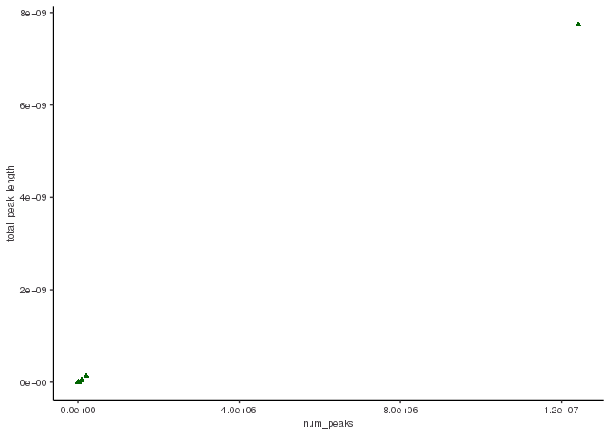
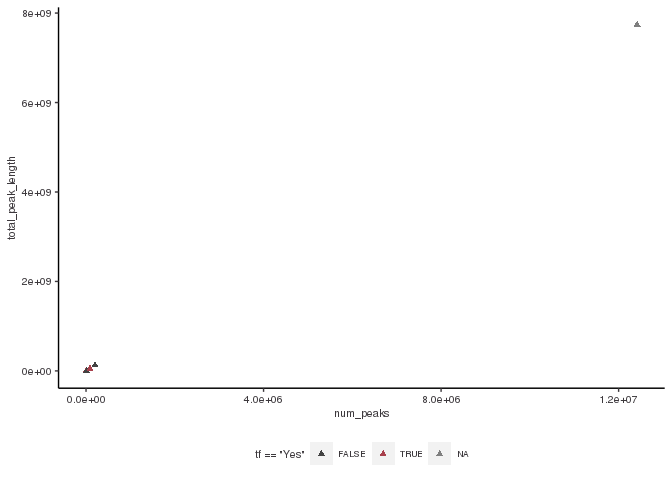
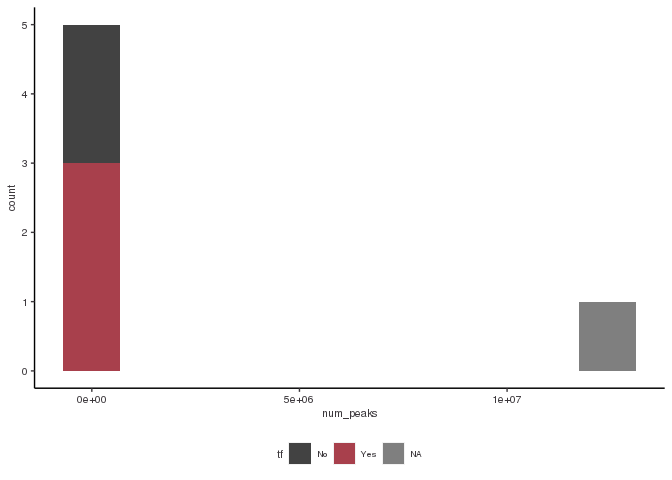
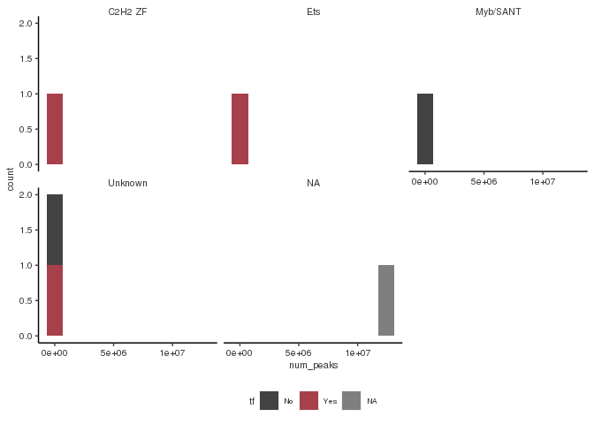

Class\_exercise
================
Byanka Estudillo
3/16/2023

### Load the libraries you need

### Load functions you need “my\_class\_functions”

### load in your peak files for each replicate of each protein

### Here I am starting to analyze my data for my proteins of interest:

### protein CEBPZ, CHD2, CTCF, ELF1, and EP300

### First I will read in each replicate file

``` r
# filepath to import peaks
basepath <- "/scratch/Shares/rinnclass/CLASS_2023/byes1293"
peak_path <- "group/results/bwa/mergedLibrary/macs/broadPeak/"
broadpeakfilepath <- file.path(basepath, peak_path)

# printing out a table of the number of peaks in each file:
# import peaks
peak_list <- import_peaks(consensus_file_path = broadpeakfilepath)
# let's get a list of how many peaks are in each file before we create consensus peaks.
peak_num <- sapply(peak_list, length) %>% as.data.frame(row.names = T)
```

    ## Warning in as.data.frame.integer(., row.names = T): 'row.names' is not a
    ## character vector of length 22 -- omitting it. Will be an error!

``` r
# label column
names(peak_num) <- c("num_peaks")

# make dbp name a col.
peak_num <- peak_num %>%
  rownames_to_column(var = "dbp") %>%
  separate(col = dbp,  into = c('dbp', 'replicate'), sep = "_")

peak_num
```

    ##      dbp replicate num_peaks
    ## 1  CEBPZ        R1       273
    ## 2  CEBPZ        R2       402
    ## 3   CHD2        R1     22119
    ## 4   CHD2        R2     13012
    ## 5   CTCF        R1     36870
    ## 6   CTCF        R2     65526
    ## 7   CTCF        R3     83141
    ## 8   CTCF        R4     55484
    ## 9   CTCF        R5     52373
    ## 10  CTCF        R6     44241
    ## 11  CTCF        R7     71705
    ## 12  CTCF        R8     68383
    ## 13  ELF1        R1     25895
    ## 14  ELF1        R2     35371
    ## 15  ELF1        R3     23188
    ## 16  ELF1        R4     15436
    ## 17 EP300        R1     38462
    ## 18 EP300        R2     59348
    ## 19 EP300        R3      4471
    ## 20 EP300        R4      6888
    ## 21 EP300        R5     10270
    ## 22 EP300        R6       882

### Now I am going to create consensus peaks for each protein

``` r
# first we need a list of unique dbps as input parameter
dbps <- unique(sapply(names(peak_list), function(x) {
   unlist(strsplit(x, "_"))[1]
}))

# now run our function consensus_from_reduced
consensus_list <- lapply(dbps, consensus_from_reduced, peak_list)
names(consensus_list) <- dbps

dbps
```

    ## [1] "CEBPZ" "CHD2"  "CTCF"  "ELF1"  "EP300"

``` r
# let's see the num_peaks for consensus 
num_consensus_peaks <- sapply(consensus_list, length) %>% 
  as.data.frame() %>%
  rownames_to_column( var = "dbp") %>%
  dplyr::rename(number_consensus_peaks = ".")

# merge into num_peaks
peak_num <- left_join(peak_num, num_consensus_peaks)
```

    ## Joining with `by = join_by(dbp)`

``` r
peak_num
```

    ##      dbp replicate num_peaks number_consensus_peaks
    ## 1  CEBPZ        R1       273                    172
    ## 2  CEBPZ        R2       402                    172
    ## 3   CHD2        R1     22119                   8815
    ## 4   CHD2        R2     13012                   8815
    ## 5   CTCF        R1     36870                  28799
    ## 6   CTCF        R2     65526                  28799
    ## 7   CTCF        R3     83141                  28799
    ## 8   CTCF        R4     55484                  28799
    ## 9   CTCF        R5     52373                  28799
    ## 10  CTCF        R6     44241                  28799
    ## 11  CTCF        R7     71705                  28799
    ## 12  CTCF        R8     68383                  28799
    ## 13  ELF1        R1     25895                  11874
    ## 14  ELF1        R2     35371                  11874
    ## 15  ELF1        R3     23188                  11874
    ## 16  ELF1        R4     15436                  11874
    ## 17 EP300        R1     38462                    568
    ## 18 EP300        R2     59348                    568
    ## 19 EP300        R3      4471                    568
    ## 20 EP300        R4      6888                    568
    ## 21 EP300        R5     10270                    568
    ## 22 EP300        R6       882                    568

``` r
# export consensus peaks to results folder
# setting file path to export
basepath <- "/scratch/Shares/rinnclass/CLASS_2023/byes1293"
consensus_path <- "CLASS_2023/CLASSES/05_R_analyses/class_exercise1/results/consensus_peaks/"
exportpath <- file.path(basepath, consensus_path)

# now we can export each as .bed file
for(i in 1:length(consensus_list)) {
rtracklayer::export(consensus_list[[i]], paste0(exportpath, names(consensus_list)[i], "_consensus_peaks.bed") )}
```

### Now I am going to make my consensus peaks compatable with UCSC genome browser

``` r
# FIRST a file list:
consensus_file_list <- list.files("/scratch/Shares/rinnclass/CLASS_2023/byes1293/CLASS_2023/CLASSES/05_R_analyses/class_exercise1/results/consensus_peaks", full.names = T, pattern = ".bed")

# lapply (for loop) across consensus file list to add colnames
# The actual col names for .broadPeak are: chr, start, end, name, score, strand
peaks <- lapply(consensus_file_list, read.table, col.names = c("chr", "start", "end", "name", "score", "strand"))

names(peaks) <- dbps

# make chromosomes of interest object
canonical_chr <- c(paste0("chr", 1:22), "chrM", "chrX", "chrY")

# let's use lapply with filter funciton to cannonical_chr
peaks <- lapply(peaks, function(x) x %>% filter(chr %in% canonical_chr))


# now that these are all nice and clean let's export:
new_filenames <- paste0("results/consensus_peaks/", names(peaks), "_consensus.bed")

for(i in 1:length(peaks)) {
  write.table(peaks[[i]], new_filenames[[i]],
              sep = "\t", col.names = FALSE, row.names = FALSE,
              quote = FALSE, append = TRUE)
}

# we are using paste0 to print the header text
# then we are adding the names as the value the header equals with 'names' function
headers <- paste0("track type=bed name=", names(peaks))
headers
```

    ##  [1] "track type=bed name=CEBPZ" "track type=bed name=CHD2" 
    ##  [3] "track type=bed name=CTCF"  "track type=bed name=ELF1" 
    ##  [5] "track type=bed name=EP300" "track type=bed name=NA"   
    ##  [7] "track type=bed name=NA"    "track type=bed name=NA"   
    ##  [9] "track type=bed name=NA"    "track type=bed name=NA"   
    ## [11] "track type=bed name=NA"

``` r
# print out consensus peak files in a results/UCSC directory
# creating a path to export after we add header in for loop below
new_filenames <- paste0("results/ucsc_consensus_peaks/", names(peaks), ".bed")
new_filenames
```

    ##  [1] "results/ucsc_consensus_peaks/CEBPZ.bed"
    ##  [2] "results/ucsc_consensus_peaks/CHD2.bed" 
    ##  [3] "results/ucsc_consensus_peaks/CTCF.bed" 
    ##  [4] "results/ucsc_consensus_peaks/ELF1.bed" 
    ##  [5] "results/ucsc_consensus_peaks/EP300.bed"
    ##  [6] "results/ucsc_consensus_peaks/NA.bed"   
    ##  [7] "results/ucsc_consensus_peaks/NA.bed"   
    ##  [8] "results/ucsc_consensus_peaks/NA.bed"   
    ##  [9] "results/ucsc_consensus_peaks/NA.bed"   
    ## [10] "results/ucsc_consensus_peaks/NA.bed"   
    ## [11] "results/ucsc_consensus_peaks/NA.bed"

``` r
# let's do so more indexing and only print out the first two of the three files.

for(i in 1:length(peaks)) {
  # Write the header line
  writeLines(headers[[i]], new_filenames[[i]])
  # Append the broadPeak table data
  
  write.table(peaks[[i]], new_filenames[[i]],
              sep = "\t", col.names = FALSE, row.names = FALSE,
              quote = FALSE, append = TRUE)
}
```

### Now I want to compare a protein with a previous analysis

``` r
# goto UCSC genome browser and load in a peak file for a given protein
# load in the data for the same protein from the previous analysis
# compare how your consensus peaks are similar or different to previous analyses
knitr::include_graphics("ucsc_screenshot.png")
```

<!-- -->

``` r
#My consensus peaks for ELF1 are similar to the previous analyses. The peaks line up really well.
```

### Now I am going to determine how my peaks for each protein overlap annotations of the genome

### First I will find the overlaps between my consensus peaks with promoters of lncRNA and mRNA promoters

``` r
# starting annotation file that we will use moving forward.
lncrna_mrna_genes <- rtracklayer::import("results/gene_annotations/mrna_lncrna_genes.gtf")

# Nice that loaded so much faster -- lets see as DF
lncrna_mrna_genes_df <- lncrna_mrna_genes %>% as.data.frame()

# importing promoter annotations
lncrna_mrna_promoters <- rtracklayer::import("results/gene_annotations/lncrna_mrna_promoters.gtf")

# last handy annotation will be lncRNA and mRNA gene IDs to subset
lncrna_gene_ids <- mrna_lncrna_genes$gene_id[mrna_lncrna_genes$gene_type == "lncRNA"]
table(mrna_lncrna_genes$gene_type)
```

    ## 
    ##         lncRNA protein_coding 
    ##          16849          19965

``` r
# same for mRNAs
mrna_gene_ids <-mrna_lncrna_genes$gene_id[mrna_lncrna_genes$gene_type == "protein_coding"]


# find overlaps of promoters for each protein
# filepath to import peaks
basepath <- "/scratch/Shares/rinnclass/CLASS_2023/byes1293"
peak_path <- "CLASS_2023/CLASSES/05_R_analyses/class_exercise1/results/consensus_peaks"
consensusPeakPath <- file.path(basepath, peak_path)

consensus_peaks_files <- list.files(consensusPeakPath, 
                                             pattern = "*consensus.bed",
                                             full.names = TRUE)

# lapply with import function to make a list of GRanges
consensus_peaks <- lapply(consensus_peaks_files, rtracklayer::import)

# adding DBP name to each list of GRanges from the file name
# note gsub requires no space around or argument ( | )
names(consensus_peaks) <- gsub("/scratch/Shares/rinnclass/CLASS_2023/byes1293/CLASS_2023/CLASSES/05_R_analyses/class_exercise1/results/consensus_peaks/|_consensus.bed","", consensus_peaks_files)

# Let's start with loading in the number of peaks each DBP has -- using length.
num_peaks_df <- data.frame("dbp" = names(consensus_peaks),
                           "num_peaks" = sapply(consensus_peaks, length))


# Now let's get the total amount of the genome covered by all the peaks for a given DBP.
num_peaks_df$total_peak_length <- sapply(consensus_peaks, function(x) sum(width(x)))

# counting promoter overlaps
promoter_peak_counts <- count_peaks_per_feature(lncrna_mrna_promoters, consensus_peaks, type = "counts")

# ok we see this is a large matrix of the number of overlaps at each promoter
# cols are promoters, rows are DBPS
# so now we just row sum for each DBP !
num_peaks_df$peaks_overlapping_promoters <- rowSums(promoter_peak_counts)
```

## results:

\#1) What can you determine from these overlaps? CEBPZ has more peaks
overlapping promoters than its total number of peaks. CHD2 has almost
the same numer of peaks overlapping promoters as its total number of
peaks. It looks like those two proteins especially tend to bind near
promoters.

### Now I want to compare the overlaps with lncRNA and mRNA promoters seperately

``` r
# Now let's break these promoters into two groups "lncrna" and "mrna"
# We will use the gene_id objects we made above to index and separate them.
num_peaks_df$peaks_overlapping_lncrna_promoters <- rowSums(promoter_peak_counts[,lncrna_gene_ids])

# mrna promoter overlaps
num_peaks_df$peaks_overlapping_mrna_promoters <- rowSums(promoter_peak_counts[,mrna_gene_ids])
```

## results:

# 1) What is the difference in overlaps between mRNA and lncRNA promoters

Looks like the number of peaks overlapping lncrna promoters tend to be a
lot less than the number of peaks overlapping mrna promoters. EP300
seems to be an exception where the number of peaks overlapping lncrna
promoters is more than the number of peaks overlapping mrna promoters.

### Now I am going to test if there is more binding over gene bodies than promoters

### I will seperate lncRNA and mRNA gene bodies to find the overlaps

``` r
# Finding overlaps with gene_bodies (will take a few minutes again)
# Note this takes 10-15 min
genebody_peak_counts <- count_peaks_per_feature(mrna_lncrna_genes, 
                                                consensus_peaks, 
                                                type = "counts")

# Now let's extract the overlaps the same way we did for promoters above

# All gene bodies
num_peaks_df$peaks_overlapping_genebody <- 
  rowSums(genebody_peak_counts)

# lncRNA gene bodies 
num_peaks_df$peaks_overlapping_lncrna_genebody <- rowSums(genebody_peak_counts[,lncrna_gene_ids])

# mRNA gene bodies
num_peaks_df$peaks_overlapping_mrna_genebody <- 
  rowSums(genebody_peak_counts[,mrna_gene_ids])

write_csv(num_peaks_df, "results/num_peaks_df.csv")
```

## results:

# 1) Do my proteins have more overlaps with promoters or genebodies?

Overall, it looks like my proteins overlap more with genebodies than
promoters.

### I am curious if my proteins are transcription factors so I will use the annotations

### in a cell paper I found and see

``` r
url <- "https://www.cell.com/cms/10.1016/j.cell.2018.01.029/attachment/ede37821-fd6f-41b7-9a0e-9d5410855ae6/mmc2.xlsx"

destination_for_url <- "results/TF_annotations.xlsx"

# to download we can use download.file
download.file(url, destination_for_url)

#redx1::read_excel to import
human_tfs <- readxl::read_excel("results/TF_annotations.xlsx",
                                sheet = 2, skip = 1)
```

    ## Warning: Expecting logical in M1006 / R1006C13: got 'Contains a SANT and
    ## multiple DNA-binding C2H2 domains. Motif is 99% AA ID from mouse (Transfac).'

    ## Warning: Expecting logical in M1021 / R1021C13: got 'Close ortholog (PP1RA)
    ## binds to mRNA; single-stranded DNA (ssDNA); poly(A) and poly(G) homopolymers
    ## (Uniprot)'

    ## Warning: Expecting logical in M1542 / R1542C13: got 'Contains 1 SANT domain'

    ## Warning: Expecting logical in M1543 / R1543C13: got 'Contains 2 Myb DBDs.
    ## Sources of Hocomoco/Transfac motifs are unclear. However these sequences look
    ## similar to in vitro sites selected by SELEX (PMID:11082045)'

    ## Warning: Expecting logical in M1544 / R1544C13: got 'Although CHD2 has weak
    ## similarity to a Myb domain (PMID:9326634), it's more closely related to the
    ## non-DNA-binding SANT domain based on our alignment analysis. The data showing
    ## that show that CHD2 binding histone H3.3 (PMID:22569126) further support the
    ## conclusion that the Myb domain is probably a SANT domain facilitating the
    ## histone interaction'

    ## Warning: Expecting logical in M1545 / R1545C13: got 'Contains a single SANT
    ## domain, no evidence for sequence-specific DNA binding'

    ## Warning: Expecting logical in M1546 / R1546C13: got 'Contains 2 Myb DBDs'

    ## Warning: Expecting logical in M1547 / R1547C13: got 'Contains 2 SANT domains,
    ## and no other putative DNA-binding domains'

    ## Warning: Expecting logical in M1548 / R1548C13: got 'Contains 2 SANT domains,
    ## and no other putative DNA-binding domains'

    ## Warning: Expecting logical in M1549 / R1549C13: got 'Contains a single SANT
    ## domain, no evidence for sequence-specific DNA binding'

    ## Warning: Expecting logical in M1550 / R1550C13: got 'Domain is truncated, and
    ## there is nothing known about this gene'

    ## Warning: Expecting logical in M1551 / R1551C13: got 'Contains a single SANT
    ## domain, no evidence for sequence-specific DNA binding'

    ## Warning: Expecting logical in M1552 / R1552C13: got 'MIER2's Myb domain is more
    ## similar to the non-DNA-binding SANT domain'

    ## Warning: Expecting logical in M1553 / R1553C13: got 'MIER3's Myb domain is more
    ## similar to the non-DNA-binding SANT domain'

    ## Warning: Expecting logical in M1554 / R1554C13: got 'Contains 1 SANT domain,
    ## and a SANTA domain'

    ## Warning: Expecting logical in M1555 / R1555C13: got 'Contains a single Myb-like
    ## domain with an insertion in the middle. It is ambiguous whether Myb-like
    ## domains are DNA or protein binding. Since it has a single domain it's likely
    ## non-specific, but future experiments should be performed to assay it's
    ## specificity'

    ## Warning: Expecting logical in M1556 / R1556C13: got 'Contains 3 Myb DBDs'

    ## Warning: Expecting logical in M1557 / R1557C13: got 'Contains 3 Myb DBDs'

    ## Warning: Expecting logical in M1558 / R1558C13: got 'Contains 3 Myb DBDs'

    ## Warning: Expecting logical in M1559 / R1559C13: got 'Contains a single Myb-like
    ## domain. Mouse ortholog has motif'

    ## Warning: Expecting logical in M1560 / R1560C13: got 'MYSM1 has been shown to
    ## bind DNA ? interaction with DNA requires the MYSM1 Myb but not the SWIRM domain
    ## (PMID:17428495). Domain sequence alignment places it near DNA-binding Myb
    ## domains but scores slightly higher as a SANT rather than Myb domain based on
    ## Prosite patterns. Given that most Myb proteins that bind DNA sequence
    ## specifically have multiple Myb domains in an array this protein could bind DNA
    ## sequence non-specifically with it?s single Myb domain. Future experiments
    ## should assay MYSM1?s specificity'

    ## Warning: Expecting logical in M1561 / R1561C13: got 'Contains 2 SANT domains,
    ## and no other putative DNA-binding domains'

    ## Warning: Expecting logical in M1562 / R1562C13: got 'Contains 2 SANT domains,
    ## and no other putative DNA-binding domains'

    ## Warning: Expecting logical in M1564 / R1564C13: got 'Contains 2 SANT domains,
    ## and no other putative DNA-binding domains'

    ## Warning: Expecting logical in M1565 / R1565C13: got 'Contains 2 SANT domains,
    ## and no other putative DNA-binding domains'

    ## Warning: Expecting logical in M1566 / R1566C13: got 'Contains 2 SANT domains,
    ## and no other putative DNA-binding domains. RCOR3 SANT domains are known to
    ## facilitate PPIs'

    ## Warning: Expecting logical in M1567 / R1567C13: got 'SMARCA1 contains a
    ## truncated Myb-like and SANT domain. Given the presence of the Myb-like domain,
    ## and other domains known to associated with DNA (DEAD box helicase) it likely
    ## associates with DNA non-sequence-specifically'

    ## Warning: Expecting logical in M1568 / R1568C13: got 'Contains a SANT, and
    ## Myb-like domain'

    ## Warning: Expecting logical in M1569 / R1569C13: got 'Contains 1 SANT domain,
    ## and no other putative DNA-binding domains. Motif logos look like bZIP dimeric
    ## binding sites, and are thus likely specificifities of SMARCC1 interactors'

    ## Warning: Expecting logical in M1570 / R1570C13: got 'Contains 1 SANT domain,
    ## and no other putative DNA-binding domains. Motif logos ares likely
    ## specificifities of SMARCC2 interactors'

    ## Warning: Expecting logical in M1571 / R1571C13: got 'Contains only Myb DBDs'

    ## Warning: Expecting logical in M1572 / R1572C13: got 'Contains 1 SANT domain'

    ## Warning: Expecting logical in M1573 / R1573C13: got 'TADA2B contains a single
    ## SANT domain and is thus unlikely to bind DNA'

    ## Warning: Expecting logical in M1574 / R1574C13: got 'Contains a single Myb
    ## domain (with slightly less simialrity to a SANT domain.) This domain has been
    ## shown to be involved in PPIs but this may not be mutually exclusive with
    ## DNA-binding. The sequence-specificity of CCDC79 should be investigated in the
    ## future'

    ## Warning: Expecting logical in M1575 / R1575C13: got 'Contains 1 Myb domain, and
    ## has structural evidence of DNA-binding'

    ## Warning: Expecting logical in M1576 / R1576C13: got 'Motif is inferred from
    ## mouse (92% DBD AA ID)'

    ## Warning: Expecting logical in M1577 / R1577C13: got 'TERF2IP contains a single
    ## Myb-like domain. While it's unclear if TERF2IP (Human Rap1) contacts DNA
    ## directly it has been shown to affect the DNA binding activity of TRF2'

    ## Warning: Expecting logical in M1578 / R1578C13: got 'This protein contains Myb,
    ## and Myb-like domains and is annotated as a Pol1 terminator. TTF1 DNA-binding
    ## has been demonstrated in vitro (PMID: 7597036), but it's specificity has not
    ## been determined'

    ## Warning: Expecting logical in M1579 / R1579C13: got 'Contains 1 Myb DBD'

    ## Warning: Expecting logical in M1580 / R1580C13: got 'Contains a GATA and SANT
    ## domain. Unclear whether the GATA domain is a bona fide DBD as the MTA/RERE
    ## family domains are atypical to human GATA domains (see alignment). In CIS-BP
    ## there is one protein from C.elegans that shares domain homology and binds a
    ## GATA motif (elg-27, ChIP-seq). The GATA ZnF domain of MTA1 is required for it's
    ## interaction with RBBP4 and RBBP7 (PMID:18067919). Full-length protein has been
    ## tried in HT-SELEX and did not yield a motif'

    ## Warning: Expecting logical in M1581 / R1581C13: got 'Contains a GATA and SANT
    ## domain. Unclear whether the GATA domain is a bona fide DBD as the MTA/RERE
    ## family domains are atypical to human GATA domains (see alignment). In CIS-BP
    ## there is one protein from C.elegans that shares domain homology and binds a
    ## GATA motif (elg-27, ChIP-seq). Full-length protein has been tried in HT-SELEX,
    ## and DBD has been tried on PBM - neither yielded motifs'

    ## Warning: Expecting logical in M1582 / R1582C13: got 'Contains a GATA and SANT
    ## domain. Unclear whether the GATA domain is a bona fide DBD as the MTA/RERE
    ## family domains are atypical to human GATA domains (see alignment). In CIS-BP
    ## there is one protein from C.elegans that shares domain homology and binds a
    ## GATA motif (elg-27, ChIP-seq). Hasn't been tried in any in vitro assays'

    ## Warning: Expecting logical in M1583 / R1583C13: got 'Contains a GATA and SANT
    ## domain. Unclear whether the GATA domain is a bona fide DBD as the MTA/RERE
    ## family domains are atypical to human GATA domains (see alignment). In CIS-BP
    ## there is one protein from C.elegans that shares domain homology and binds a
    ## GATA motif (elg-27, ChIP-seq). Has been tried as a DBD in HT-SELEX but did not
    ## yield a motif'

    ## Warning: Expecting logical in M1791 / R1791C13: got 'CNOT3 is a part of the
    ## CCR4-NOT complex involved in mRNA decay'

    ## Warning: Expecting logical in M1932 / R1932C13: got '"Prosite identifies a
    ## low-confidence Myb-like domain (e.g. can?t decide between Myb and SANT) so it?s
    ## probably not a TF"'

    ## New names:
    ## • `` -> `...4`

``` r
# let's rename the 4th column to indicate if it is a TF.
names(human_tfs)[4] <- "is_tf"

# now let's intersect gene names that are in our ChIP data and has TF identity.
length(which(tolower(num_peaks_df$dbp) %in% tolower(human_tfs$Name)))
```

    ## [1] 5

``` r
# first let's filter and grab the first 4 columns that match DBPs in num_peaks_df
human_tfs <- human_tfs[tolower(human_tfs$Name) %in% tolower(num_peaks_df$dbp), 1:4]


# adding new column names
names(human_tfs) <- c("ensembl_id",
                      "dbp",
                      "dbd",
                      "tf")

# Now comes the actual merge. Let's look at it first
# ?merge

num_peaks_df <- merge(num_peaks_df, human_tfs, all.x = T)

# Let's check how many NAs -- we should have some missing values.
dim(num_peaks_df[is.na(num_peaks_df$tf),])
```

    ## [1]  1 12

``` r
num_peaks_df <- num_peaks_df[,1:12]

num_peaks_df
```

    ##     dbp num_peaks total_peak_length peaks_overlapping_promoters
    ## 1 CEBPZ      1376            538696                        1704
    ## 2  CHD2     13631           6404610                       14052
    ## 3  CTCF     90504          50240723                       60464
    ## 4  ELF1     83211          42977547                       77848
    ## 5 EP300    202161         130745868                       27004
    ## 6    NA  12417257        7741873086                     5306783
    ##   peaks_overlapping_lncrna_promoters peaks_overlapping_mrna_promoters
    ## 1                                272                             1432
    ## 2                               2646                            11406
    ## 3                              13195                            47269
    ## 4                              15735                            62113
    ## 5                               9398                            17606
    ## 6                            1253389                          4053394
    ##   peaks_overlapping_genebody peaks_overlapping_lncrna_genebody
    ## 1                       1656                               248
    ## 2                      16249                              2745
    ## 3                      95379                             18407
    ## 4                      98580                             17598
    ## 5                     155895                             37018
    ## 6                   11648861                           2484439
    ##   peaks_overlapping_mrna_genebody      ensembl_id      dbd   tf
    ## 1                            1408 ENSG00000115816  Unknown  Yes
    ## 2                           13504 ENSG00000173575 Myb/SANT   No
    ## 3                           76972 ENSG00000102974  C2H2 ZF  Yes
    ## 4                           80982 ENSG00000120690      Ets  Yes
    ## 5                          118877 ENSG00000100393  Unknown   No
    ## 6                         9164422            <NA>     <NA> <NA>

### It is nice and all to find overlaps, but I am interested in how many proteins

### bind a specific promoter. I will use my handy “occurence” parameter in

### " count peaks per feature"

``` r
# note similar as above but using type = occurnece
promoter_peak_occurence <- count_peaks_per_feature(lncrna_mrna_promoters, consensus_peaks, 
                                               type = "occurrence")

# Let's double check that all lncrna & mrna genes are accounted for:
stopifnot(all(colnames(promoter_peak_occurence) == lncrna_mrna_promoters$gene_id))

# First make sure promoter_peak_occurrence and lncrna_mrna_promoters are in the same order
stopifnot(all(colnames(promoter_peak_occurence) == lncrna_mrna_promoters$gene_id))


# Now let's use the 'data.frame()' fucntion. Set up a bunch of colnames and populate them.
peak_occurence_df <- data.frame("gene_id" = colnames(promoter_peak_occurence),
                                "gene_name" = lncrna_mrna_promoters$gene_name,
                                "gene_type" = lncrna_mrna_promoters$gene_type,
                                "chr" = lncrna_mrna_promoters@seqnames,   
                                "1kb_up_tss_start" = lncrna_mrna_promoters@ranges@start,
                                "strand" = lncrna_mrna_promoters@strand,
                                "number_of_dbp" = colSums(promoter_peak_occurence))
```

## results: I find the max number of proteins on a promoter to be 4

### Now I want to start plotting my results

### First I will see if there is a relationship between peak number and total DNA covered

``` r
source("/scratch/Shares/rinnclass/CLASS_2023/byes1293/CLASS_2023/util/plotting_functions.R")
source("/scratch/Shares/rinnclass/CLASS_2023/byes1293/CLASS_2023/util/_setup.R")

# let's make this simple plot first: number of peaks -vs- total peak length
ggplot(num_peaks_df, aes(x = num_peaks, 
                         y = total_peak_length)) +
  geom_point(shape = 'triangle',
             color = 'dark green') 
```

<!-- -->

### Now I want to color my plot by wether the protein is a TF or not.

``` r
ggplot(num_peaks_df, aes(x = num_peaks, 
                 y = total_peak_length,
                 color = tf == "Yes")) +
  geom_point(shape = 'triangle')
```

<!-- -->

### I want to make a histogram of the number of peaks for each of my proteins

``` r
ggplot(num_peaks_df, aes(x = num_peaks, fill = tf)) +
  geom_histogram(bins = 10)
```

<!-- -->

### Now I want to facet this by the type of DNA binding domain my protein has.

``` r
ggplot(num_peaks_df, aes(x = num_peaks, fill = tf)) +
  facet_wrap(dbd ~ .) +
  geom_histogram(bins = 10)
```


<!-- -->

### Cool now I am ready to send my result to my collaborator as a

### Knitted document
