Final\_class\_project
================
Byanka Estudillo
05/01/2023

# Your mission should you choose to accept it

There is an enormous amount of data in ENCODE that needs to be analyzed.
This includes 480 unique DBP ChIPseq datasets. To facilitate your
mission we provide you 1,066 peak files that have been run through the
NF\_CORE chipseq pipeline.

You will find all the .broadPeak peak files here:
/scratch/Shares/rinnclass/CLASS\_2023/data/data/peaks

Use what you have learned in class to uncover new results from this
daunting data set. \# Good luck the genome depends on you!

# first you might want to think about your organization

# 1) create a directory in your class folder for these analyses

    # -> folder name
          -> util/
            -> scripts.R
          -> analysis/
            -> 01_consensus_peaks
              -> .RMD
              -> results/
              -> figures
            -> 02_clustering etc....

# Consensus peaks

# Num\_peaks\_df

# Peak\_occurence\_df

# lncRNA and or mRNA promoters / gene annotations

# SAVE THIS !! save(object\_name, nextobject, …., file = “where you save this.Rdata”)

# load(file.Rdata)

# creating filtered consensus peaks

``` r
# filepath to import peaks
broadpeakfilepath <- "/scratch/Shares/rinnclass/CLASS_2023/data/data/peaks"

# using import peaks to import .broadPeak files
peak_list <- import_peaks(consensus_file_path = broadpeakfilepath)

# Creating unique DBP object for create_consensus_peaks_from_reduced
dbp <- unique(sapply(names(peak_list), function(x) {
   unlist(strsplit(x, "_"))[1]
}))

# now run our function consensus_from_reduced
consensus_list <- lapply(dbp, consensus_from_reduced, peak_list)

# adding names to the GRange list
names(consensus_list) <- dbp

### Filter out any chip data less 1,000 peaks == filtered consensus peaks ###
# filtering to 1000 peaks
filtered_consensus_list <- consensus_list[sapply(consensus_list, length) > 1000]

# setting file path to export
exportpath <- "/scratch/Shares/rinnclass/CLASS_2023/byes1293/CLASS_2023/CLASSES/Final_Rmd/results/filtered_consensus_peaks/"

for(i in 1:length(filtered_consensus_list)) {
  rtracklayer::export(filtered_consensus_list[[i]], 
                      paste0(exportpath, 
                             names(filtered_consensus_list)[i], 
                             "_filtered_consensus_peaks.bed"))
}
```

# loading in genome features

``` r
gencode_gr <- rtracklayer::import("/scratch/Shares/rinnclass/CLASS_2023/data/data/genomes/gencode.v32.annotation.gtf")

# gencode genes
gencode_genes <- gencode_gr[gencode_gr$type == "gene"] 

# mrna_genes
mrna_genes <- gencode_genes[gencode_genes$gene_type %in% "protein_coding"]

# lncrna_genes
lncrna_genes <- gencode_genes[gencode_genes$gene_type %in% "lncRNA"] 

# mrna_lncrna_genes
mrna_lncrna_genes <- gencode_genes[gencode_genes$gene_type %in% c("protein_coding","lncRNA")]

# lncrna_mrna_promoters
lncrna_mrna_promoters <- promoters(mrna_lncrna_genes, upstream = 1000, downstream = 1000)

# lncrna_gene_ids
lncrna_gene_ids <- mrna_lncrna_genes$gene_id[mrna_lncrna_genes$gene_type == "lncRNA"]

# mrna_gene_ids
mrna_gene_ids <-mrna_lncrna_genes$gene_id[mrna_lncrna_genes$gene_type == "protein_coding"]
```

# making data frame of filtered\_consensus\_peak info

``` r
num_peaks_df <- data.frame("dbp" = names(filtered_consensus_list),
                           "num_peaks" = sapply(filtered_consensus_list, length))

# total genome covered by peaks
num_peaks_df$total_peak_length <- sapply(filtered_consensus_list, function(x) sum(width(x)))

# creating number of promoter overlaps entry
promoter_peak_counts <- count_peaks_per_feature(lncrna_mrna_promoters, filtered_consensus_list, type = "counts")

# creating promoter peak_occurence for clustering - Metaplots later.
promoter_peak_matrix <- count_peaks_per_feature(lncrna_mrna_promoters, filtered_consensus_list, type = "occurrence")

# saving
# write.table(promoter_peak_matrix, "results/promoter_peak_occurrence_matrix.tsv")

# read back in
promoter_peak_occurrence_matrix <- read.table("results/promoter_peak_occurrence_matrix.tsv")

# summing rows to get total number of promoter overlaps
num_peaks_df$peaks_overlapping_promoters <- rowSums(promoter_peak_counts)

# lncrna promoter overlaps 
num_peaks_df$peaks_overlapping_lncrna_promoters <- rowSums(promoter_peak_counts[,lncrna_gene_ids])

# mrna promoter overlaps
num_peaks_df$peaks_overlapping_mrna_promoters <- rowSums(promoter_peak_counts[,mrna_gene_ids])

# Finding overlaps with gene_bodies (will take a few minutes again)
# Note this takes several minutes
genebody_peak_counts <- count_peaks_per_feature(mrna_lncrna_genes, 
                                                filtered_consensus_list, 
                                                type = "counts")

# All gene bodies overlaps
num_peaks_df$peaks_overlapping_genebody <- rowSums(genebody_peak_counts)

# lncRNA gene bodies 
num_peaks_df$peaks_overlapping_lncrna_genebody <- rowSums(genebody_peak_counts[,lncrna_gene_ids])

# mRNA gene bodies
num_peaks_df$peaks_overlapping_mrna_genebody <- rowSums(genebody_peak_counts[,mrna_gene_ids])
```

# creating promoter peak occurence matrix

``` r
# running count_peaks_per_feature
promoter_peak_occurence <- count_peaks_per_feature(lncrna_mrna_promoters, filtered_consensus_list, 
                                               type = "occurrence")

# Let's double check that all lncrna & mrna genes are accounted for:
stopifnot(all(colnames(promoter_peak_occurence) == lncrna_mrna_promoters$gene_id))

# Now let's use the 'data.frame()' fucntion. Set up a bunch of colnames and populate them.
peak_occurence_df <- data.frame("gene_id" = colnames(promoter_peak_occurence),
                                "gene_name" = lncrna_mrna_promoters$gene_name,
                                "gene_type" = lncrna_mrna_promoters$gene_type,
                                "chr" = lncrna_mrna_promoters@seqnames,   
                                "1kb_up_tss_start" = lncrna_mrna_promoters@ranges@start,
                                "strand" = lncrna_mrna_promoters@strand,
                                "number_of_dbp" = colSums(promoter_peak_occurence))
```

# plotting num\_peaks versus genome coverage.

``` r
### How does peak number and genome coverage compare ###
ggplot(num_peaks_df, aes(x = num_peaks, y = total_peak_length)) +
  geom_point() + 
  geom_smooth(method = "gam", se = TRUE, color = "black", lty = 2)+
  ylab("BP covered") +
  xlab("Number of peaks") +
  ggtitle("Peak count vs. total bases covered")
```

    ## `geom_smooth()` using formula = 'y ~ s(x, bs = "cs")'

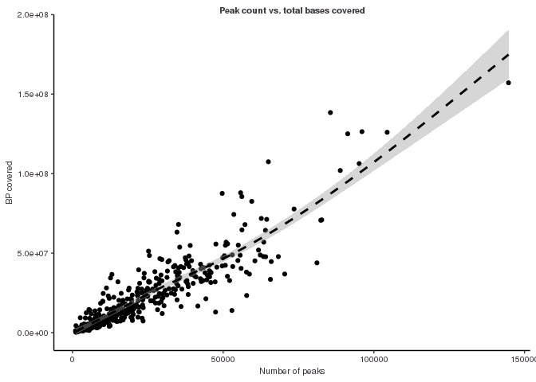<!-- -->

``` r
# saving 
# ggsave("figures/peak_num_vs_coverage.pdf")
```

Result: there is a linear relationship between number of peaks and total
coverage

# Promoter overlaps vs gene bodies

``` r
### What is the distribution of promoter overlaps versus gene-bodies (hint hist) ###
## Histogram of peaks overlapping with promoters
hist(num_peaks_df$peaks_overlapping_promoters)
```

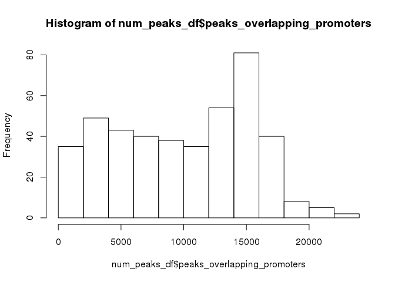<!-- -->

``` r
# Histogram of peaks overlapping gene bodies
hist(num_peaks_df$peaks_overlapping_genebody)
```

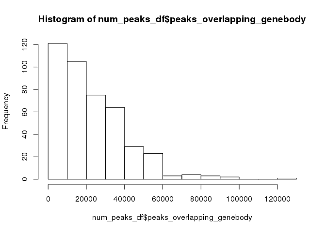<!-- -->

# Finding super binders

``` r
### Make a list of genes that are "super binders" ###
ggplot(peak_occurence_df, aes(x = number_of_dbp)) +
geom_density(alpha = 0.2, color = "#424242", fill = "#424242") +
  theme_paperwhite() +
  xlab(expression("Number of DBPs")) +
  ylab(expression("Density")) +
  ggtitle("Promoter binding events",
          subtitle = "mRNA and lncRNA genes") +
  facet_wrap(~gene_type)
```

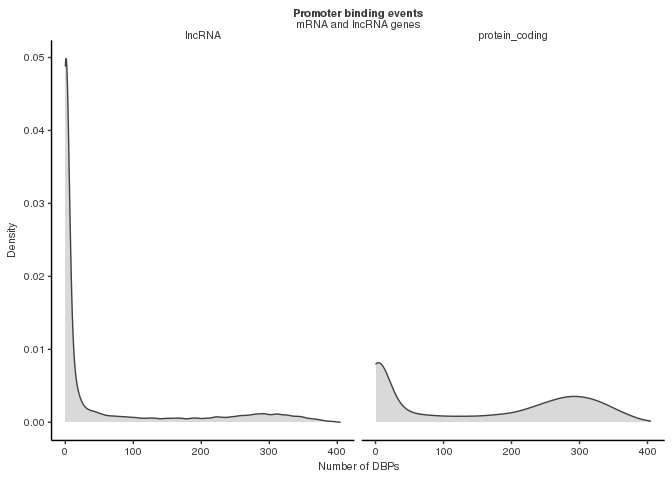<!-- -->

``` r
#ggsave("figures/super_binder_lncRNA_mRNA_curves.pdf", height = 5, width = 8)

# super binding promoters have greater than 200 DBPs bound
# add indicator for super binders
peak_occurence_df <- peak_occurence_df %>% 
  mutate(super_binder = ifelse(number_of_dbp < 200, "not super binder", "super binder"))
```

# Comparing mRNA and lncRNA promoter overlaps

``` r
### Is there a difference in mRNA and lncRNA promoter overlaps? ###
ggplot(num_peaks_df, aes(x = num_peaks)) +
  geom_point(aes(y = peaks_overlapping_lncrna_promoters), color = "red") +
  geom_point(aes(y = peaks_overlapping_mrna_promoters), color = "black") +
  #stat_regline_equation(aes(y = peaks_overlapping_lncrna_promoters), color = "red") +
  #stat_regline_equation(aes(y = peaks_overlapping_mrna_promoters), color = "black", label.y = 20000) +
  geom_smooth(aes(y = peaks_overlapping_lncrna_promoters), method = "lm", se = FALSE, formula = "y ~ x") +
  geom_smooth(aes(y = peaks_overlapping_mrna_promoters), method = "lm", se = FALSE, formula = "y ~ x")
```

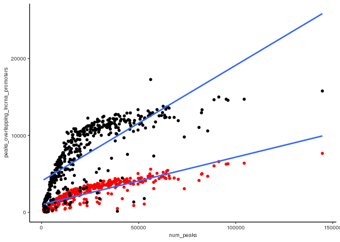<!-- -->

``` r
# saving
#ggsave("figures/lncRNA-mRNA-promoter_binding.pdf")
```

Results: mRNA promoters have more binding than lncRNA promoters.

``` r
### Do lncRNAs also have super-binding promoters? ###
# Subsetting list of super binding lncRNA promoters 
lncrna_super_binders <- subset(peak_occurence_df, gene_type == "lncRNA" & super_binder == "super binder")

nrow(lncrna_super_binders)
```

    ## [1] 2521

``` r
# Subsetting list of super binding mRNA promoters 
mrna_super_binders <- subset(peak_occurence_df, gene_type == "protein_coding" & super_binder == "super binder")

nrow(mrna_super_binders)
```

    ## [1] 9201

Results: I found 2521 lncRNA superbinding promoters and 9201 mRNA
super-promoters

# Adding TF type annotations for DBPs

``` r
human_tfs <- readxl::read_excel("/scratch/Shares/rinnclass/CLASS_2023/byes1293/CLASS_2023/CLASSES/Final_Rmd/results/TF_annotations.xlsx", skip = 1)
```

    ## Warning: Expecting logical in M1006 / R1006C13: got 'Contains a SANT and
    ## multiple DNA-binding C2H2 domains. Motif is 99% AA ID from mouse (Transfac).'

    ## Warning: Expecting logical in M1021 / R1021C13: got 'Close ortholog (PP1RA)
    ## binds to mRNA; single-stranded DNA (ssDNA); poly(A) and poly(G) homopolymers
    ## (Uniprot)'

    ## Warning: Expecting logical in M1542 / R1542C13: got 'Contains 1 SANT domain'

    ## Warning: Expecting logical in M1543 / R1543C13: got 'Contains 2 Myb DBDs.
    ## Sources of Hocomoco/Transfac motifs are unclear. However these sequences look
    ## similar to in vitro sites selected by SELEX (PMID:11082045)'

    ## Warning: Expecting logical in M1544 / R1544C13: got 'Although CHD2 has weak
    ## similarity to a Myb domain (PMID:9326634), it's more closely related to the
    ## non-DNA-binding SANT domain based on our alignment analysis. The data showing
    ## that show that CHD2 binding histone H3.3 (PMID:22569126) further support the
    ## conclusion that the Myb domain is probably a SANT domain facilitating the
    ## histone interaction'

    ## Warning: Expecting logical in M1545 / R1545C13: got 'Contains a single SANT
    ## domain, no evidence for sequence-specific DNA binding'

    ## Warning: Expecting logical in M1546 / R1546C13: got 'Contains 2 Myb DBDs'

    ## Warning: Expecting logical in M1547 / R1547C13: got 'Contains 2 SANT domains,
    ## and no other putative DNA-binding domains'

    ## Warning: Expecting logical in M1548 / R1548C13: got 'Contains 2 SANT domains,
    ## and no other putative DNA-binding domains'

    ## Warning: Expecting logical in M1549 / R1549C13: got 'Contains a single SANT
    ## domain, no evidence for sequence-specific DNA binding'

    ## Warning: Expecting logical in M1550 / R1550C13: got 'Domain is truncated, and
    ## there is nothing known about this gene'

    ## Warning: Expecting logical in M1551 / R1551C13: got 'Contains a single SANT
    ## domain, no evidence for sequence-specific DNA binding'

    ## Warning: Expecting logical in M1552 / R1552C13: got 'MIER2's Myb domain is more
    ## similar to the non-DNA-binding SANT domain'

    ## Warning: Expecting logical in M1553 / R1553C13: got 'MIER3's Myb domain is more
    ## similar to the non-DNA-binding SANT domain'

    ## Warning: Expecting logical in M1554 / R1554C13: got 'Contains 1 SANT domain,
    ## and a SANTA domain'

    ## Warning: Expecting logical in M1555 / R1555C13: got 'Contains a single Myb-like
    ## domain with an insertion in the middle. It is ambiguous whether Myb-like
    ## domains are DNA or protein binding. Since it has a single domain it's likely
    ## non-specific, but future experiments should be performed to assay it's
    ## specificity'

    ## Warning: Expecting logical in M1556 / R1556C13: got 'Contains 3 Myb DBDs'

    ## Warning: Expecting logical in M1557 / R1557C13: got 'Contains 3 Myb DBDs'

    ## Warning: Expecting logical in M1558 / R1558C13: got 'Contains 3 Myb DBDs'

    ## Warning: Expecting logical in M1559 / R1559C13: got 'Contains a single Myb-like
    ## domain. Mouse ortholog has motif'

    ## Warning: Expecting logical in M1560 / R1560C13: got 'MYSM1 has been shown to
    ## bind DNA ? interaction with DNA requires the MYSM1 Myb but not the SWIRM domain
    ## (PMID:17428495). Domain sequence alignment places it near DNA-binding Myb
    ## domains but scores slightly higher as a SANT rather than Myb domain based on
    ## Prosite patterns. Given that most Myb proteins that bind DNA sequence
    ## specifically have multiple Myb domains in an array this protein could bind DNA
    ## sequence non-specifically with it?s single Myb domain. Future experiments
    ## should assay MYSM1?s specificity'

    ## Warning: Expecting logical in M1561 / R1561C13: got 'Contains 2 SANT domains,
    ## and no other putative DNA-binding domains'

    ## Warning: Expecting logical in M1562 / R1562C13: got 'Contains 2 SANT domains,
    ## and no other putative DNA-binding domains'

    ## Warning: Expecting logical in M1564 / R1564C13: got 'Contains 2 SANT domains,
    ## and no other putative DNA-binding domains'

    ## Warning: Expecting logical in M1565 / R1565C13: got 'Contains 2 SANT domains,
    ## and no other putative DNA-binding domains'

    ## Warning: Expecting logical in M1566 / R1566C13: got 'Contains 2 SANT domains,
    ## and no other putative DNA-binding domains. RCOR3 SANT domains are known to
    ## facilitate PPIs'

    ## Warning: Expecting logical in M1567 / R1567C13: got 'SMARCA1 contains a
    ## truncated Myb-like and SANT domain. Given the presence of the Myb-like domain,
    ## and other domains known to associated with DNA (DEAD box helicase) it likely
    ## associates with DNA non-sequence-specifically'

    ## Warning: Expecting logical in M1568 / R1568C13: got 'Contains a SANT, and
    ## Myb-like domain'

    ## Warning: Expecting logical in M1569 / R1569C13: got 'Contains 1 SANT domain,
    ## and no other putative DNA-binding domains. Motif logos look like bZIP dimeric
    ## binding sites, and are thus likely specificifities of SMARCC1 interactors'

    ## Warning: Expecting logical in M1570 / R1570C13: got 'Contains 1 SANT domain,
    ## and no other putative DNA-binding domains. Motif logos ares likely
    ## specificifities of SMARCC2 interactors'

    ## Warning: Expecting logical in M1571 / R1571C13: got 'Contains only Myb DBDs'

    ## Warning: Expecting logical in M1572 / R1572C13: got 'Contains 1 SANT domain'

    ## Warning: Expecting logical in M1573 / R1573C13: got 'TADA2B contains a single
    ## SANT domain and is thus unlikely to bind DNA'

    ## Warning: Expecting logical in M1574 / R1574C13: got 'Contains a single Myb
    ## domain (with slightly less simialrity to a SANT domain.) This domain has been
    ## shown to be involved in PPIs but this may not be mutually exclusive with
    ## DNA-binding. The sequence-specificity of CCDC79 should be investigated in the
    ## future'

    ## Warning: Expecting logical in M1575 / R1575C13: got 'Contains 1 Myb domain, and
    ## has structural evidence of DNA-binding'

    ## Warning: Expecting logical in M1576 / R1576C13: got 'Motif is inferred from
    ## mouse (92% DBD AA ID)'

    ## Warning: Expecting logical in M1577 / R1577C13: got 'TERF2IP contains a single
    ## Myb-like domain. While it's unclear if TERF2IP (Human Rap1) contacts DNA
    ## directly it has been shown to affect the DNA binding activity of TRF2'

    ## Warning: Expecting logical in M1578 / R1578C13: got 'This protein contains Myb,
    ## and Myb-like domains and is annotated as a Pol1 terminator. TTF1 DNA-binding
    ## has been demonstrated in vitro (PMID: 7597036), but it's specificity has not
    ## been determined'

    ## Warning: Expecting logical in M1579 / R1579C13: got 'Contains 1 Myb DBD'

    ## Warning: Expecting logical in M1580 / R1580C13: got 'Contains a GATA and SANT
    ## domain. Unclear whether the GATA domain is a bona fide DBD as the MTA/RERE
    ## family domains are atypical to human GATA domains (see alignment). In CIS-BP
    ## there is one protein from C.elegans that shares domain homology and binds a
    ## GATA motif (elg-27, ChIP-seq). The GATA ZnF domain of MTA1 is required for it's
    ## interaction with RBBP4 and RBBP7 (PMID:18067919). Full-length protein has been
    ## tried in HT-SELEX and did not yield a motif'

    ## Warning: Expecting logical in M1581 / R1581C13: got 'Contains a GATA and SANT
    ## domain. Unclear whether the GATA domain is a bona fide DBD as the MTA/RERE
    ## family domains are atypical to human GATA domains (see alignment). In CIS-BP
    ## there is one protein from C.elegans that shares domain homology and binds a
    ## GATA motif (elg-27, ChIP-seq). Full-length protein has been tried in HT-SELEX,
    ## and DBD has been tried on PBM - neither yielded motifs'

    ## Warning: Expecting logical in M1582 / R1582C13: got 'Contains a GATA and SANT
    ## domain. Unclear whether the GATA domain is a bona fide DBD as the MTA/RERE
    ## family domains are atypical to human GATA domains (see alignment). In CIS-BP
    ## there is one protein from C.elegans that shares domain homology and binds a
    ## GATA motif (elg-27, ChIP-seq). Hasn't been tried in any in vitro assays'

    ## Warning: Expecting logical in M1583 / R1583C13: got 'Contains a GATA and SANT
    ## domain. Unclear whether the GATA domain is a bona fide DBD as the MTA/RERE
    ## family domains are atypical to human GATA domains (see alignment). In CIS-BP
    ## there is one protein from C.elegans that shares domain homology and binds a
    ## GATA motif (elg-27, ChIP-seq). Has been tried as a DBD in HT-SELEX but did not
    ## yield a motif'

    ## Warning: Expecting logical in M1791 / R1791C13: got 'CNOT3 is a part of the
    ## CCR4-NOT complex involved in mRNA decay'

    ## Warning: Expecting logical in M1932 / R1932C13: got '"Prosite identifies a
    ## low-confidence Myb-like domain (e.g. can?t decide between Myb and SANT) so it?s
    ## probably not a TF"'

    ## New names:
    ## • `` -> `...4`

``` r
names(human_tfs)[4] <- "is_tf"

length(which(tolower(num_peaks_df$dbp) %in% tolower(human_tfs$Name)))
```

    ## [1] 407

``` r
human_tfs <- human_tfs[tolower(human_tfs$Name) %in% tolower(num_peaks_df$dbp), 1:4]

names(human_tfs) <- c("ensembl_id",
                      "dbp",
                      "dbd",
                      "tf")

num_peaks_df <- merge(num_peaks_df, human_tfs, all.x = T)

#write_csv(num_peaks_df, "results/num_peaks_df.csv")

### How many of these proteins are TFs? What is the most represented type of DBD? ###
yes_tf <- subset(num_peaks_df, tf == "Yes")
nrow(yes_tf)
```

    ## [1] 344

``` r
no_tf <- subset(num_peaks_df, tf == "No")
nrow(no_tf)
```

    ## [1] 63

Result: Exactly 344 of our DBPs are TFs and 63 of our DBPs are not TFs.
That leaves 25 of our DBPs as neither.

# saving key env objects

``` r
#save(filtered_consensus_list, gencode_genes, lncrna_gene_ids, lncrna_mrna_promoters, mrna_gene_ids, num_peaks_df, peak_occurence_df, promoter_peak_occurrence_matrix, lncrna_mrna_promoters, mrna_lncrna_genes, file = "results/peak_features.RData")

#load("results/peak_features.RData", verbose = T)
```

# Let’s see how similar our genes are to each other

# Clustering

``` r
promoter_peak_occurence_matrix <- read.table("analysis/01_create_consensus_peaks/results/promoter_peak_occurrence_matrix.tsv")

# creating distance matrix
peak_occurence_dist <- dist(promoter_peak_occurence_matrix, method = "binary")

# clustering distance values
bin_hier <- hclust(peak_occurence_dist, method = "complete")

# Dendrogram of binding profiles by promoter (not binding profile - below)
ggdendro::ggdendrogram(bin_hier, rotate = FALSE,  size = 3, 
                       theme_dendro = TRUE) +
   coord_flip() +
   scale_y_continuous() +
   scale_x_continuous(position = "top") +
   scale_x_continuous(breaks = seq_along(bin_hier$labels[bin_hier$order]),
             labels = bin_hier$labels[bin_hier$order], position = "top",
             expand = c(0,0)) +
   theme(axis.text.x = element_text(angle = 90, hjust  = 1)) + 
   theme(axis.text.y = element_text(angle = 0,hjust = 1)) +
   scale_y_reverse(expand = c(0.01, 0)) +
   theme(
     plot.background = element_blank(),
     panel.grid.major = element_blank(),
   panel.grid.minor = element_blank(),
     panel.border = element_blank()
   )
```

    ## Scale for y is already present.
    ## Adding another scale for y, which will replace the existing scale.
    ## Scale for x is already present.
    ## Adding another scale for x, which will replace the existing scale.
    ## Scale for x is already present.
    ## Adding another scale for x, which will replace the existing scale.
    ## Scale for y is already present.
    ## Adding another scale for y, which will replace the existing scale.

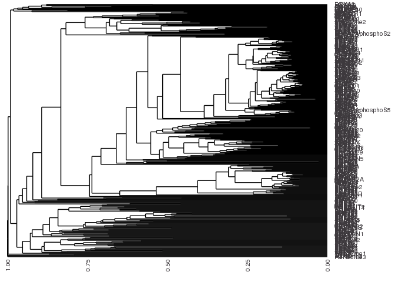<!-- -->

``` r
#ggsave("figures/promoter_overlap_dendogram.pdf", height = 50, width = 12, limitsize = F)

### if we cluster by lncRNA and mRNA separately what are some similarities and differences? ###
lncrna_promoters <- lncrna_mrna_promoters[lncrna_mrna_promoters$gene_type == "lncRNA"]

mrna_promoters <- lncrna_mrna_promoters[lncrna_mrna_promoters$gene_type == "protein_coding"]

# for lncRNAs
lncrna_peak_occurence <- promoter_peak_occurence_matrix[,lncrna_promoters$gene_id]

length(lncrna_peak_occurence)
```

    ## [1] 16849

``` r
bin_hier_lncrna <- hclust(dist(lncrna_peak_occurence, method = "binary"))

ggdendro::ggdendrogram(bin_hier_lncrna, rotate = T,  size = 3)
```

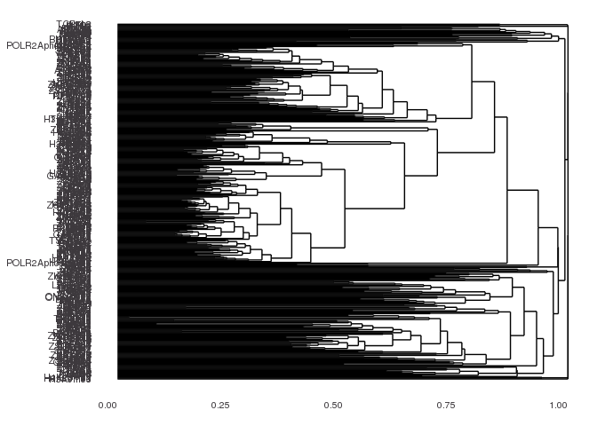<!-- -->

``` r
#ggsave("figures/lncrna_hclust_binary_dist.pdf", height = 49, width = 6)

# for mRNAs
mrna_peak_occurence <- promoter_peak_occurence_matrix[,mrna_promoters$gene_id]

bin_hier_mrna <- hclust(dist(mrna_peak_occurence, method = "binary"))

ggdendro::ggdendrogram(bin_hier_mrna, rotate = T,  size = 3)
```

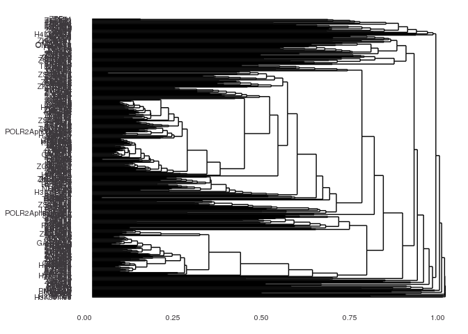<!-- -->

``` r
#ggsave("figures/mrna_hclust_binary_dist.pdf", height = 44, width = 6)
```

# saving key objects

``` r
#save(promoter_peak_occurence_matrix, peak_occurence_dist, bin_hier, lncrna_peak_occurence, lncrna_promoters, bin_hier_lncrna, mrna_peak_occurence, mrna_promoters, bin_hier_mrna, file = "results/peak_features.RData")

#load("results/clusters.RData", verbose = T)
```

# Metaplots

``` r
### Let's look at the metaplot for all DBPs on lncRNA and mRNA promoters separately (hint facet wrap) ###
#setting up lncrna DF.
lncrna_metaplot_df <- data.frame(x = integer(), dens = numeric(), dbp = character())

# for loop to populate DF with overlap density in lncrna promoters
suppressWarnings({
  for(i in 1:length(filtered_consensus_list)) {
  print(names(filtered_consensus_list)[[i]])
  tmp_df <- profile_tss(filtered_consensus_list[[i]], lncrna_mrna_promoters = lncrna_promoters)
  tmp_df$dbp <- names(filtered_consensus_list)[[i]]
  lncrna_metaplot_df <- bind_rows(lncrna_metaplot_df, tmp_df)
  
  }
})
```

    ## [1] "ADNP"
    ## [1] "AFF4"
    ## [1] "AHDC1"
    ## [1] "AHR"
    ## [1] "AKAP8"
    ## [1] "ARID3A"
    ## [1] "ARID4A"
    ## [1] "ARID4B"
    ## [1] "ARID5B"
    ## [1] "ARNTL"
    ## [1] "ASH2L"
    ## [1] "ATAD3A"
    ## [1] "ATF2"
    ## [1] "ATF3"
    ## [1] "ATF5"
    ## [1] "ATF6"
    ## [1] "ATF7"
    ## [1] "BCL3"
    ## [1] "BCL6"
    ## [1] "BHLHE40"
    ## [1] "BRCA1"
    ## [1] "CAMTA2"
    ## [1] "CBFB"
    ## [1] "CBX5"
    ## [1] "CEBPA"
    ## [1] "CEBPB"
    ## [1] "CEBPD"
    ## [1] "CEBPG"
    ## [1] "CERS6"
    ## [1] "CHD2"
    ## [1] "CREB3"
    ## [1] "CREM"
    ## [1] "CTCF"
    ## [1] "DBP"
    ## [1] "DDIT3"
    ## [1] "DLX6"
    ## [1] "DMAP1"
    ## [1] "DMTF1"
    ## [1] "DNMT1"
    ## [1] "DPF2"
    ## [1] "DRAP1"
    ## [1] "DZIP1"
    ## [1] "E2F1"
    ## [1] "E2F2"
    ## [1] "E2F4"
    ## [1] "E2F5"
    ## [1] "EEA1"
    ## [1] "EED"
    ## [1] "EGR1"
    ## [1] "ELF1"
    ## [1] "ELF3"
    ## [1] "ELF4"
    ## [1] "ELK1"
    ## [1] "ERF"
    ## [1] "ESRRA"
    ## [1] "ETS1"
    ## [1] "ETV5"
    ## [1] "ETV6"
    ## [1] "EZH2"
    ## [1] "FOSL2"
    ## [1] "FOXA1"
    ## [1] "FOXA2"
    ## [1] "FOXA3"
    ## [1] "FOXJ3"
    ## [1] "FOXK1"
    ## [1] "FOXM1"
    ## [1] "FOXO1"
    ## [1] "FOXP1"
    ## [1] "FOXP4"
    ## [1] "FUBP1"
    ## [1] "FUBP3"
    ## [1] "GABPA"
    ## [1] "GABPB1"
    ## [1] "GATA2"
    ## [1] "GATAD1"
    ## [1] "GATAD2A"
    ## [1] "GLI4"
    ## [1] "GMEB1"
    ## [1] "GMEB2"
    ## [1] "GPN1"
    ## [1] "GTF2F1"
    ## [1] "GTF3A"
    ## [1] "GZF1"
    ## [1] "H2AFZ"
    ## [1] "H3K27ac"
    ## [1] "H3K36me3"
    ## [1] "H3K4me1"
    ## [1] "H3K4me2"
    ## [1] "H3K4me3"
    ## [1] "H3K79me2"
    ## [1] "H3K9ac"
    ## [1] "H3K9me3"
    ## [1] "H4K20me1"
    ## [1] "HCFC1"
    ## [1] "HDAC1"
    ## [1] "HDAC2"
    ## [1] "HINFP"
    ## [1] "HIVEP1"
    ## [1] "HMG20A"
    ## [1] "HMG20B"
    ## [1] "HMGXB3"
    ## [1] "HMGXB4"
    ## [1] "HNF1A"
    ## [1] "HNF1B"
    ## [1] "HNF4A"
    ## [1] "HNF4G"
    ## [1] "HOMEZ"
    ## [1] "HOXA3"
    ## [1] "HOXA5"
    ## [1] "HOXD1"
    ## [1] "HSF2"
    ## [1] "IKZF4"
    ## [1] "IKZF5"
    ## [1] "IRF1"
    ## [1] "IRF2"
    ## [1] "IRF5"
    ## [1] "ISL2"
    ## [1] "ISX"
    ## [1] "JUN"
    ## [1] "JUND"
    ## [1] "KAT7"
    ## [1] "KAT8"
    ## [1] "KDM1A"
    ## [1] "KDM2A"
    ## [1] "KDM3A"
    ## [1] "KDM4B"
    ## [1] "KDM5B"
    ## [1] "KDM6A"
    ## [1] "KLF11"
    ## [1] "KLF12"
    ## [1] "KLF13"
    ## [1] "KLF16"
    ## [1] "KLF6"
    ## [1] "KLF9"
    ## [1] "KMT2A"
    ## [1] "KMT2B"
    ## [1] "LBX2"
    ## [1] "LCOR"
    ## [1] "LCORL"
    ## [1] "LIN54"
    ## [1] "LRRFIP1"
    ## [1] "MAF1"
    ## [1] "MAFF"
    ## [1] "MAFG"
    ## [1] "MAFK"
    ## [1] "MATR3"
    ## [1] "MAX"
    ## [1] "MAZ"
    ## [1] "MED1"
    ## [1] "MED13"
    ## [1] "MEF2A"
    ## [1] "MEF2D"
    ## [1] "MIER2"
    ## [1] "MIER3"
    ## [1] "MIXL1"
    ## [1] "MLX"
    ## [1] "MNX1"
    ## [1] "MTA1"
    ## [1] "MTF2"
    ## [1] "MXD1"
    ## [1] "MXD3"
    ## [1] "MXD4"
    ## [1] "MXI1"
    ## [1] "MYNN"
    ## [1] "MYRF"
    ## [1] "NAIF1"
    ## [1] "NFAT5"
    ## [1] "NFATC3"
    ## [1] "NFE2L1"
    ## [1] "NFE2L2"
    ## [1] "NFIA"
    ## [1] "NFIC"
    ## [1] "NFIL3"
    ## [1] "NFKB2"
    ## [1] "NFKBIZ"
    ## [1] "NFYA"
    ## [1] "NFYB"
    ## [1] "NFYC"
    ## [1] "NKX3-1"
    ## [1] "NR0B2"
    ## [1] "NR2C2"
    ## [1] "NR2F1"
    ## [1] "NR2F6"
    ## [1] "NR5A1"
    ## [1] "NRF1"
    ## [1] "NRL"
    ## [1] "ONECUT1"
    ## [1] "ONECUT2"
    ## [1] "PAF1"
    ## [1] "PATZ1"
    ## [1] "PAWR"
    ## [1] "PAXIP1"
    ## [1] "PHF20"
    ## [1] "PHF21A"
    ## [1] "PHF5A"
    ## [1] "PHF8"
    ## [1] "PITX1"
    ## [1] "POGZ"
    ## [1] "POLR2A"
    ## [1] "POLR2AphosphoS2"
    ## [1] "POLR2AphosphoS5"
    ## [1] "PPARG"
    ## [1] "PRDM10"
    ## [1] "PRDM15"
    ## [1] "PREB"
    ## [1] "RAD21"
    ## [1] "RARA"
    ## [1] "RARG"
    ## [1] "RBAK"
    ## [1] "RBPJ"
    ## [1] "RCOR1"
    ## [1] "RCOR2"
    ## [1] "RELA"
    ## [1] "RERE"
    ## [1] "REST"
    ## [1] "RFX3"
    ## [1] "RFX5"
    ## [1] "RFXANK"
    ## [1] "RFXAP"
    ## [1] "RREB1"
    ## [1] "RXRA"
    ## [1] "RXRB"
    ## [1] "SAFB2"
    ## [1] "SAP130"
    ## [1] "SATB2"
    ## [1] "SFPQ"
    ## [1] "SIN3A"
    ## [1] "SIN3B"
    ## [1] "SIX1"
    ## [1] "SIX4"
    ## [1] "SMAD1"
    ## [1] "SMAD3"
    ## [1] "SMAD4"
    ## [1] "SMAD9"
    ## [1] "SMC3"
    ## [1] "SNAI1"
    ## [1] "SNAPC4"
    ## [1] "SOX13"
    ## [1] "SOX18"
    ## [1] "SOX6"
    ## [1] "SP140L"
    ## [1] "SP5"
    ## [1] "SPEN"
    ## [1] "SRF"
    ## [1] "STAG1"
    ## [1] "STAT5B"
    ## [1] "STAT6"
    ## [1] "SUZ12"
    ## [1] "TAF1"
    ## [1] "TBL1XR1"
    ## [1] "TBP"
    ## [1] "TBX2"
    ## [1] "TCF3"
    ## [1] "TCF7L2"
    ## [1] "TEAD1"
    ## [1] "TEAD3"
    ## [1] "TEF"
    ## [1] "TFAP4"
    ## [1] "TFDP1"
    ## [1] "TFDP2"
    ## [1] "TFE3"
    ## [1] "THAP11"
    ## [1] "THAP8"
    ## [1] "THAP9"
    ## [1] "THRA"
    ## [1] "THRB"
    ## [1] "TIGD3"
    ## [1] "TIGD6"
    ## [1] "TOE1"
    ## [1] "TP53"
    ## [1] "TRAFD1"
    ## [1] "TSC22D2"
    ## [1] "UBTF"
    ## [1] "USF1"
    ## [1] "USF2"
    ## [1] "WIZ"
    ## [1] "XBP1"
    ## [1] "YEATS2"
    ## [1] "YEATS4"
    ## [1] "YY1"
    ## [1] "ZBED4"
    ## [1] "ZBED5"
    ## [1] "ZBTB1"
    ## [1] "ZBTB10"
    ## [1] "ZBTB14"
    ## [1] "ZBTB21"
    ## [1] "ZBTB24"
    ## [1] "ZBTB25"
    ## [1] "ZBTB26"
    ## [1] "ZBTB38"
    ## [1] "ZBTB39"
    ## [1] "ZBTB4"
    ## [1] "ZBTB42"
    ## [1] "ZBTB43"
    ## [1] "ZBTB44"
    ## [1] "ZBTB46"
    ## [1] "ZBTB49"
    ## [1] "ZBTB7A"
    ## [1] "ZBTB7B"
    ## [1] "ZC3H4"
    ## [1] "ZC3H8"
    ## [1] "ZCCHC11"
    ## [1] "ZFP1"
    ## [1] "ZFP14"
    ## [1] "ZFP36L2"
    ## [1] "ZFP37"
    ## [1] "ZFP41"
    ## [1] "ZFP64"
    ## [1] "ZFP82"
    ## [1] "ZFY"
    ## [1] "ZGPAT"
    ## [1] "ZHX3"
    ## [1] "ZIK1"
    ## [1] "ZKSCAN1"
    ## [1] "ZKSCAN5"
    ## [1] "ZKSCAN8"
    ## [1] "ZMYM3"
    ## [1] "ZNF12"
    ## [1] "ZNF124"
    ## [1] "ZNF138"
    ## [1] "ZNF142"
    ## [1] "ZNF143"
    ## [1] "ZNF205"
    ## [1] "ZNF217"
    ## [1] "ZNF224"
    ## [1] "ZNF225"
    ## [1] "ZNF230"
    ## [1] "ZNF232"
    ## [1] "ZNF234"
    ## [1] "ZNF25"
    ## [1] "ZNF256"
    ## [1] "ZNF263"
    ## [1] "ZNF264"
    ## [1] "ZNF274"
    ## [1] "ZNF276"
    ## [1] "ZNF280B"
    ## [1] "ZNF280D"
    ## [1] "ZNF281"
    ## [1] "ZNF296"
    ## [1] "ZNF30"
    ## [1] "ZNF317"
    ## [1] "ZNF318"
    ## [1] "ZNF326"
    ## [1] "ZNF331"
    ## [1] "ZNF333"
    ## [1] "ZNF335"
    ## [1] "ZNF337"
    ## [1] "ZNF33B"
    ## [1] "ZNF34"
    ## [1] "ZNF343"
    ## [1] "ZNF350"
    ## [1] "ZNF362"
    ## [1] "ZNF383"
    ## [1] "ZNF384"
    ## [1] "ZNF407"
    ## [1] "ZNF414"
    ## [1] "ZNF44"
    ## [1] "ZNF446"
    ## [1] "ZNF451"
    ## [1] "ZNF460"
    ## [1] "ZNF483"
    ## [1] "ZNF485"
    ## [1] "ZNF490"
    ## [1] "ZNF501"
    ## [1] "ZNF503"
    ## [1] "ZNF510"
    ## [1] "ZNF511"
    ## [1] "ZNF512"
    ## [1] "ZNF512B"
    ## [1] "ZNF513"
    ## [1] "ZNF526"
    ## [1] "ZNF543"
    ## [1] "ZNF547"
    ## [1] "ZNF548"
    ## [1] "ZNF550"
    ## [1] "ZNF556"
    ## [1] "ZNF557"
    ## [1] "ZNF572"
    ## [1] "ZNF574"
    ## [1] "ZNF576"
    ## [1] "ZNF580"
    ## [1] "ZNF598"
    ## [1] "ZNF607"
    ## [1] "ZNF608"
    ## [1] "ZNF609"
    ## [1] "ZNF614"
    ## [1] "ZNF616"
    ## [1] "ZNF619"
    ## [1] "ZNF629"
    ## [1] "ZNF639"
    ## [1] "ZNF644"
    ## [1] "ZNF652"
    ## [1] "ZNF660"
    ## [1] "ZNF674"
    ## [1] "ZNF678"
    ## [1] "ZNF687"
    ## [1] "ZNF691"
    ## [1] "ZNF697"
    ## [1] "ZNF709"
    ## [1] "ZNF710"
    ## [1] "ZNF713"
    ## [1] "ZNF720"
    ## [1] "ZNF737"
    ## [1] "ZNF740"
    ## [1] "ZNF761"
    ## [1] "ZNF766"
    ## [1] "ZNF768"
    ## [1] "ZNF772"
    ## [1] "ZNF773"
    ## [1] "ZNF775"
    ## [1] "ZNF776"
    ## [1] "ZNF777"
    ## [1] "ZNF781"
    ## [1] "ZNF782"
    ## [1] "ZNF784"
    ## [1] "ZNF786"
    ## [1] "ZNF788"
    ## [1] "ZNF792"
    ## [1] "ZNF800"
    ## [1] "ZNF83"
    ## [1] "ZNF839"
    ## [1] "ZNF883"
    ## [1] "ZNF891"
    ## [1] "ZSCAN20"
    ## [1] "ZSCAN22"
    ## [1] "ZSCAN29"
    ## [1] "ZSCAN31"
    ## [1] "ZSCAN9"
    ## [1] "ZXDC"
    ## [1] "ZZZ3"

``` r
# saving
#write_rds(lncrna_metaplot_df, "results/lncRNA_metaplot_df_final.rds")

# now for mRNAs 
mrna_metaplot_df <- data.frame(x = integer(), dens = numeric(), dbp = character())

# for loop to populate mRNA_metaplot
suppressWarnings({
  for(i in 1:length(filtered_consensus_list)) {
  print(names(filtered_consensus_list)[[i]])
  tmp_df <- profile_tss(filtered_consensus_list[[i]], lncrna_mrna_promoters = mrna_promoters)
  tmp_df$dbp <- names(filtered_consensus_list)[[i]]
  mrna_metaplot_df <- bind_rows(mrna_metaplot_df, tmp_df)
  
  }
})
```

    ## [1] "ADNP"
    ## [1] "AFF4"
    ## [1] "AHDC1"
    ## [1] "AHR"
    ## [1] "AKAP8"
    ## [1] "ARID3A"
    ## [1] "ARID4A"
    ## [1] "ARID4B"
    ## [1] "ARID5B"
    ## [1] "ARNTL"
    ## [1] "ASH2L"
    ## [1] "ATAD3A"
    ## [1] "ATF2"
    ## [1] "ATF3"
    ## [1] "ATF5"
    ## [1] "ATF6"
    ## [1] "ATF7"
    ## [1] "BCL3"
    ## [1] "BCL6"
    ## [1] "BHLHE40"
    ## [1] "BRCA1"
    ## [1] "CAMTA2"
    ## [1] "CBFB"
    ## [1] "CBX5"
    ## [1] "CEBPA"
    ## [1] "CEBPB"
    ## [1] "CEBPD"
    ## [1] "CEBPG"
    ## [1] "CERS6"
    ## [1] "CHD2"
    ## [1] "CREB3"
    ## [1] "CREM"
    ## [1] "CTCF"
    ## [1] "DBP"
    ## [1] "DDIT3"
    ## [1] "DLX6"
    ## [1] "DMAP1"
    ## [1] "DMTF1"
    ## [1] "DNMT1"
    ## [1] "DPF2"
    ## [1] "DRAP1"
    ## [1] "DZIP1"
    ## [1] "E2F1"
    ## [1] "E2F2"
    ## [1] "E2F4"
    ## [1] "E2F5"
    ## [1] "EEA1"
    ## [1] "EED"
    ## [1] "EGR1"
    ## [1] "ELF1"
    ## [1] "ELF3"
    ## [1] "ELF4"
    ## [1] "ELK1"
    ## [1] "ERF"
    ## [1] "ESRRA"
    ## [1] "ETS1"
    ## [1] "ETV5"
    ## [1] "ETV6"
    ## [1] "EZH2"
    ## [1] "FOSL2"
    ## [1] "FOXA1"
    ## [1] "FOXA2"
    ## [1] "FOXA3"
    ## [1] "FOXJ3"
    ## [1] "FOXK1"
    ## [1] "FOXM1"
    ## [1] "FOXO1"
    ## [1] "FOXP1"
    ## [1] "FOXP4"
    ## [1] "FUBP1"
    ## [1] "FUBP3"
    ## [1] "GABPA"
    ## [1] "GABPB1"
    ## [1] "GATA2"
    ## [1] "GATAD1"
    ## [1] "GATAD2A"
    ## [1] "GLI4"
    ## [1] "GMEB1"
    ## [1] "GMEB2"
    ## [1] "GPN1"
    ## [1] "GTF2F1"
    ## [1] "GTF3A"
    ## [1] "GZF1"
    ## [1] "H2AFZ"
    ## [1] "H3K27ac"
    ## [1] "H3K36me3"
    ## [1] "H3K4me1"
    ## [1] "H3K4me2"
    ## [1] "H3K4me3"
    ## [1] "H3K79me2"
    ## [1] "H3K9ac"
    ## [1] "H3K9me3"
    ## [1] "H4K20me1"
    ## [1] "HCFC1"
    ## [1] "HDAC1"
    ## [1] "HDAC2"
    ## [1] "HINFP"
    ## [1] "HIVEP1"
    ## [1] "HMG20A"
    ## [1] "HMG20B"
    ## [1] "HMGXB3"
    ## [1] "HMGXB4"
    ## [1] "HNF1A"
    ## [1] "HNF1B"
    ## [1] "HNF4A"
    ## [1] "HNF4G"
    ## [1] "HOMEZ"
    ## [1] "HOXA3"
    ## [1] "HOXA5"
    ## [1] "HOXD1"
    ## [1] "HSF2"
    ## [1] "IKZF4"
    ## [1] "IKZF5"
    ## [1] "IRF1"
    ## [1] "IRF2"
    ## [1] "IRF5"
    ## [1] "ISL2"
    ## [1] "ISX"
    ## [1] "JUN"
    ## [1] "JUND"
    ## [1] "KAT7"
    ## [1] "KAT8"
    ## [1] "KDM1A"
    ## [1] "KDM2A"
    ## [1] "KDM3A"
    ## [1] "KDM4B"
    ## [1] "KDM5B"
    ## [1] "KDM6A"
    ## [1] "KLF11"
    ## [1] "KLF12"
    ## [1] "KLF13"
    ## [1] "KLF16"
    ## [1] "KLF6"
    ## [1] "KLF9"
    ## [1] "KMT2A"
    ## [1] "KMT2B"
    ## [1] "LBX2"
    ## [1] "LCOR"
    ## [1] "LCORL"
    ## [1] "LIN54"
    ## [1] "LRRFIP1"
    ## [1] "MAF1"
    ## [1] "MAFF"
    ## [1] "MAFG"
    ## [1] "MAFK"
    ## [1] "MATR3"
    ## [1] "MAX"
    ## [1] "MAZ"
    ## [1] "MED1"
    ## [1] "MED13"
    ## [1] "MEF2A"
    ## [1] "MEF2D"
    ## [1] "MIER2"
    ## [1] "MIER3"
    ## [1] "MIXL1"
    ## [1] "MLX"
    ## [1] "MNX1"
    ## [1] "MTA1"
    ## [1] "MTF2"
    ## [1] "MXD1"
    ## [1] "MXD3"
    ## [1] "MXD4"
    ## [1] "MXI1"
    ## [1] "MYNN"
    ## [1] "MYRF"
    ## [1] "NAIF1"
    ## [1] "NFAT5"
    ## [1] "NFATC3"
    ## [1] "NFE2L1"
    ## [1] "NFE2L2"
    ## [1] "NFIA"
    ## [1] "NFIC"
    ## [1] "NFIL3"
    ## [1] "NFKB2"
    ## [1] "NFKBIZ"
    ## [1] "NFYA"
    ## [1] "NFYB"
    ## [1] "NFYC"
    ## [1] "NKX3-1"
    ## [1] "NR0B2"
    ## [1] "NR2C2"
    ## [1] "NR2F1"
    ## [1] "NR2F6"
    ## [1] "NR5A1"
    ## [1] "NRF1"
    ## [1] "NRL"
    ## [1] "ONECUT1"
    ## [1] "ONECUT2"
    ## [1] "PAF1"
    ## [1] "PATZ1"
    ## [1] "PAWR"
    ## [1] "PAXIP1"
    ## [1] "PHF20"
    ## [1] "PHF21A"
    ## [1] "PHF5A"
    ## [1] "PHF8"
    ## [1] "PITX1"
    ## [1] "POGZ"
    ## [1] "POLR2A"
    ## [1] "POLR2AphosphoS2"
    ## [1] "POLR2AphosphoS5"
    ## [1] "PPARG"
    ## [1] "PRDM10"
    ## [1] "PRDM15"
    ## [1] "PREB"
    ## [1] "RAD21"
    ## [1] "RARA"
    ## [1] "RARG"
    ## [1] "RBAK"
    ## [1] "RBPJ"
    ## [1] "RCOR1"
    ## [1] "RCOR2"
    ## [1] "RELA"
    ## [1] "RERE"
    ## [1] "REST"
    ## [1] "RFX3"
    ## [1] "RFX5"
    ## [1] "RFXANK"
    ## [1] "RFXAP"
    ## [1] "RREB1"
    ## [1] "RXRA"
    ## [1] "RXRB"
    ## [1] "SAFB2"
    ## [1] "SAP130"
    ## [1] "SATB2"
    ## [1] "SFPQ"
    ## [1] "SIN3A"
    ## [1] "SIN3B"
    ## [1] "SIX1"
    ## [1] "SIX4"
    ## [1] "SMAD1"
    ## [1] "SMAD3"
    ## [1] "SMAD4"
    ## [1] "SMAD9"
    ## [1] "SMC3"
    ## [1] "SNAI1"
    ## [1] "SNAPC4"
    ## [1] "SOX13"
    ## [1] "SOX18"
    ## [1] "SOX6"
    ## [1] "SP140L"
    ## [1] "SP5"
    ## [1] "SPEN"
    ## [1] "SRF"
    ## [1] "STAG1"
    ## [1] "STAT5B"
    ## [1] "STAT6"
    ## [1] "SUZ12"
    ## [1] "TAF1"
    ## [1] "TBL1XR1"
    ## [1] "TBP"
    ## [1] "TBX2"
    ## [1] "TCF3"
    ## [1] "TCF7L2"
    ## [1] "TEAD1"
    ## [1] "TEAD3"
    ## [1] "TEF"
    ## [1] "TFAP4"
    ## [1] "TFDP1"
    ## [1] "TFDP2"
    ## [1] "TFE3"
    ## [1] "THAP11"
    ## [1] "THAP8"
    ## [1] "THAP9"
    ## [1] "THRA"
    ## [1] "THRB"
    ## [1] "TIGD3"
    ## [1] "TIGD6"
    ## [1] "TOE1"
    ## [1] "TP53"
    ## [1] "TRAFD1"
    ## [1] "TSC22D2"
    ## [1] "UBTF"
    ## [1] "USF1"
    ## [1] "USF2"
    ## [1] "WIZ"
    ## [1] "XBP1"
    ## [1] "YEATS2"
    ## [1] "YEATS4"
    ## [1] "YY1"
    ## [1] "ZBED4"
    ## [1] "ZBED5"
    ## [1] "ZBTB1"
    ## [1] "ZBTB10"
    ## [1] "ZBTB14"
    ## [1] "ZBTB21"
    ## [1] "ZBTB24"
    ## [1] "ZBTB25"
    ## [1] "ZBTB26"
    ## [1] "ZBTB38"
    ## [1] "ZBTB39"
    ## [1] "ZBTB4"
    ## [1] "ZBTB42"
    ## [1] "ZBTB43"
    ## [1] "ZBTB44"
    ## [1] "ZBTB46"
    ## [1] "ZBTB49"
    ## [1] "ZBTB7A"
    ## [1] "ZBTB7B"
    ## [1] "ZC3H4"
    ## [1] "ZC3H8"
    ## [1] "ZCCHC11"
    ## [1] "ZFP1"
    ## [1] "ZFP14"
    ## [1] "ZFP36L2"
    ## [1] "ZFP37"
    ## [1] "ZFP41"
    ## [1] "ZFP64"
    ## [1] "ZFP82"
    ## [1] "ZFY"
    ## [1] "ZGPAT"
    ## [1] "ZHX3"
    ## [1] "ZIK1"
    ## [1] "ZKSCAN1"
    ## [1] "ZKSCAN5"
    ## [1] "ZKSCAN8"
    ## [1] "ZMYM3"
    ## [1] "ZNF12"
    ## [1] "ZNF124"
    ## [1] "ZNF138"
    ## [1] "ZNF142"
    ## [1] "ZNF143"
    ## [1] "ZNF205"
    ## [1] "ZNF217"
    ## [1] "ZNF224"
    ## [1] "ZNF225"
    ## [1] "ZNF230"
    ## [1] "ZNF232"
    ## [1] "ZNF234"
    ## [1] "ZNF25"
    ## [1] "ZNF256"
    ## [1] "ZNF263"
    ## [1] "ZNF264"
    ## [1] "ZNF274"
    ## [1] "ZNF276"
    ## [1] "ZNF280B"
    ## [1] "ZNF280D"
    ## [1] "ZNF281"
    ## [1] "ZNF296"
    ## [1] "ZNF30"
    ## [1] "ZNF317"
    ## [1] "ZNF318"
    ## [1] "ZNF326"
    ## [1] "ZNF331"
    ## [1] "ZNF333"
    ## [1] "ZNF335"
    ## [1] "ZNF337"
    ## [1] "ZNF33B"
    ## [1] "ZNF34"
    ## [1] "ZNF343"
    ## [1] "ZNF350"
    ## [1] "ZNF362"
    ## [1] "ZNF383"
    ## [1] "ZNF384"
    ## [1] "ZNF407"
    ## [1] "ZNF414"
    ## [1] "ZNF44"
    ## [1] "ZNF446"
    ## [1] "ZNF451"
    ## [1] "ZNF460"
    ## [1] "ZNF483"
    ## [1] "ZNF485"
    ## [1] "ZNF490"
    ## [1] "ZNF501"
    ## [1] "ZNF503"
    ## [1] "ZNF510"
    ## [1] "ZNF511"
    ## [1] "ZNF512"
    ## [1] "ZNF512B"
    ## [1] "ZNF513"
    ## [1] "ZNF526"
    ## [1] "ZNF543"
    ## [1] "ZNF547"
    ## [1] "ZNF548"
    ## [1] "ZNF550"
    ## [1] "ZNF556"
    ## [1] "ZNF557"
    ## [1] "ZNF572"
    ## [1] "ZNF574"
    ## [1] "ZNF576"
    ## [1] "ZNF580"
    ## [1] "ZNF598"
    ## [1] "ZNF607"
    ## [1] "ZNF608"
    ## [1] "ZNF609"
    ## [1] "ZNF614"
    ## [1] "ZNF616"
    ## [1] "ZNF619"
    ## [1] "ZNF629"
    ## [1] "ZNF639"
    ## [1] "ZNF644"
    ## [1] "ZNF652"
    ## [1] "ZNF660"
    ## [1] "ZNF674"
    ## [1] "ZNF678"
    ## [1] "ZNF687"
    ## [1] "ZNF691"
    ## [1] "ZNF697"
    ## [1] "ZNF709"
    ## [1] "ZNF710"
    ## [1] "ZNF713"
    ## [1] "ZNF720"
    ## [1] "ZNF737"
    ## [1] "ZNF740"
    ## [1] "ZNF761"
    ## [1] "ZNF766"
    ## [1] "ZNF768"
    ## [1] "ZNF772"
    ## [1] "ZNF773"
    ## [1] "ZNF775"
    ## [1] "ZNF776"
    ## [1] "ZNF777"
    ## [1] "ZNF781"
    ## [1] "ZNF782"
    ## [1] "ZNF784"
    ## [1] "ZNF786"
    ## [1] "ZNF788"
    ## [1] "ZNF792"
    ## [1] "ZNF800"
    ## [1] "ZNF83"
    ## [1] "ZNF839"
    ## [1] "ZNF883"
    ## [1] "ZNF891"
    ## [1] "ZSCAN20"
    ## [1] "ZSCAN22"
    ## [1] "ZSCAN29"
    ## [1] "ZSCAN31"
    ## [1] "ZSCAN9"
    ## [1] "ZXDC"
    ## [1] "ZZZ3"

``` r
# saving mRNA metaplots
#write_rds(mrna_metaplot_df, "results/mrna_metaplot_df_final.rds")

# now adding the information of gene type
mrna_metaplot_df$gene_type <- "mRNA"
lncrna_metaplot_df$gene_type <- "lncRNA"
combined_metaplot_profile <- bind_rows(mrna_metaplot_df, lncrna_metaplot_df)

# saving
#write_rds(mrna_metaplot_df, "results/metaplot_df_final.rds")

# plot
ggplot(combined_metaplot_profile,
  aes(x = x, y = dens, color = gene_type )) +
  geom_vline(xintercept = 0, lty = 2) +
  geom_line(size = 1.5) +
  facet_wrap(dbp ~ ., scales = "free_y") +
  ggtitle("Promoter Metaplot") +
  scale_x_continuous(breaks = c(-1000, 0, 1000),
                  labels = c("-1kb", "TSS", "+1kb"),
                  name = "") +
  ylab("Peak frequency") +
  scale_color_manual(values = c("#424242","#A8404C"))
```

    ## Warning: Using `size` aesthetic for lines was deprecated in ggplot2 3.4.0.
    ## ℹ Please use `linewidth` instead.
    ## This warning is displayed once every 8 hours.
    ## Call `lifecycle::last_lifecycle_warnings()` to see where this warning was
    ## generated.

<!-- -->

``` r
#ggsave("figures/lncrna_mrna_metaplot_profile.pdf", width = 40, height = 10)
```

# superbinder vs nonsuper binder metaplots

``` r
### Make a metaplot of DBPS only on Super-binders versus regular promoters ... ###
# What promoters make up these super binders
super_binders <- peak_occurence_df %>% 
  filter(peak_occurence_df$number_of_dbp > 200)

#write_csv(super_binders, "results/super_binders.csv")

# What promoters have less than 200 dbps bound
non_super_binders <- peak_occurence_df %>% 
  filter(peak_occurence_df$number_of_dbp < 200)

#write_csv(non_super_binders, "results/non_super_binders.csv")

# subset mRNA and lncRNA promoters by super binders
super_gr <- lncrna_mrna_promoters[lncrna_mrna_promoters$gene_id %in% super_binders$gene_id]
non_super_gr <- lncrna_mrna_promoters[lncrna_mrna_promoters$gene_id %in% non_super_binders$gene_id]

#setting up lncrna df
super_metaplot_df <- data.frame(x = integer(), dens = numeric(), dbp = character())

# for loop to populate DF with overlap density in lncrna promoters
suppressWarnings({
  for(i in 1:length(filtered_consensus_list)) {
  print(names(filtered_consensus_list)[[i]])
  tmp_df <- profile_tss(filtered_consensus_list[[i]], lncrna_mrna_promoters = super_gr)
  tmp_df$dbp <- names(filtered_consensus_list)[[i]]
  super_metaplot_df <- bind_rows(super_metaplot_df, tmp_df)
  
  }
})
```

    ## [1] "ADNP"
    ## [1] "AFF4"
    ## [1] "AHDC1"
    ## [1] "AHR"
    ## [1] "AKAP8"
    ## [1] "ARID3A"
    ## [1] "ARID4A"
    ## [1] "ARID4B"
    ## [1] "ARID5B"
    ## [1] "ARNTL"
    ## [1] "ASH2L"
    ## [1] "ATAD3A"
    ## [1] "ATF2"
    ## [1] "ATF3"
    ## [1] "ATF5"
    ## [1] "ATF6"
    ## [1] "ATF7"
    ## [1] "BCL3"
    ## [1] "BCL6"
    ## [1] "BHLHE40"
    ## [1] "BRCA1"
    ## [1] "CAMTA2"
    ## [1] "CBFB"
    ## [1] "CBX5"
    ## [1] "CEBPA"
    ## [1] "CEBPB"
    ## [1] "CEBPD"
    ## [1] "CEBPG"
    ## [1] "CERS6"
    ## [1] "CHD2"
    ## [1] "CREB3"
    ## [1] "CREM"
    ## [1] "CTCF"
    ## [1] "DBP"
    ## [1] "DDIT3"
    ## [1] "DLX6"
    ## [1] "DMAP1"
    ## [1] "DMTF1"
    ## [1] "DNMT1"
    ## [1] "DPF2"
    ## [1] "DRAP1"
    ## [1] "DZIP1"
    ## [1] "E2F1"
    ## [1] "E2F2"
    ## [1] "E2F4"
    ## [1] "E2F5"
    ## [1] "EEA1"
    ## [1] "EED"
    ## [1] "EGR1"
    ## [1] "ELF1"
    ## [1] "ELF3"
    ## [1] "ELF4"
    ## [1] "ELK1"
    ## [1] "ERF"
    ## [1] "ESRRA"
    ## [1] "ETS1"
    ## [1] "ETV5"
    ## [1] "ETV6"
    ## [1] "EZH2"
    ## [1] "FOSL2"
    ## [1] "FOXA1"
    ## [1] "FOXA2"
    ## [1] "FOXA3"
    ## [1] "FOXJ3"
    ## [1] "FOXK1"
    ## [1] "FOXM1"
    ## [1] "FOXO1"
    ## [1] "FOXP1"
    ## [1] "FOXP4"
    ## [1] "FUBP1"
    ## [1] "FUBP3"
    ## [1] "GABPA"
    ## [1] "GABPB1"
    ## [1] "GATA2"
    ## [1] "GATAD1"
    ## [1] "GATAD2A"
    ## [1] "GLI4"
    ## [1] "GMEB1"
    ## [1] "GMEB2"
    ## [1] "GPN1"
    ## [1] "GTF2F1"
    ## [1] "GTF3A"
    ## [1] "GZF1"
    ## [1] "H2AFZ"
    ## [1] "H3K27ac"
    ## [1] "H3K36me3"
    ## [1] "H3K4me1"
    ## [1] "H3K4me2"
    ## [1] "H3K4me3"
    ## [1] "H3K79me2"
    ## [1] "H3K9ac"
    ## [1] "H3K9me3"
    ## [1] "H4K20me1"
    ## [1] "HCFC1"
    ## [1] "HDAC1"
    ## [1] "HDAC2"
    ## [1] "HINFP"
    ## [1] "HIVEP1"
    ## [1] "HMG20A"
    ## [1] "HMG20B"
    ## [1] "HMGXB3"
    ## [1] "HMGXB4"
    ## [1] "HNF1A"
    ## [1] "HNF1B"
    ## [1] "HNF4A"
    ## [1] "HNF4G"
    ## [1] "HOMEZ"
    ## [1] "HOXA3"
    ## [1] "HOXA5"
    ## [1] "HOXD1"
    ## [1] "HSF2"
    ## [1] "IKZF4"
    ## [1] "IKZF5"
    ## [1] "IRF1"
    ## [1] "IRF2"
    ## [1] "IRF5"
    ## [1] "ISL2"
    ## [1] "ISX"
    ## [1] "JUN"
    ## [1] "JUND"
    ## [1] "KAT7"
    ## [1] "KAT8"
    ## [1] "KDM1A"
    ## [1] "KDM2A"
    ## [1] "KDM3A"
    ## [1] "KDM4B"
    ## [1] "KDM5B"
    ## [1] "KDM6A"
    ## [1] "KLF11"
    ## [1] "KLF12"
    ## [1] "KLF13"
    ## [1] "KLF16"
    ## [1] "KLF6"
    ## [1] "KLF9"
    ## [1] "KMT2A"
    ## [1] "KMT2B"
    ## [1] "LBX2"
    ## [1] "LCOR"
    ## [1] "LCORL"
    ## [1] "LIN54"
    ## [1] "LRRFIP1"
    ## [1] "MAF1"
    ## [1] "MAFF"
    ## [1] "MAFG"
    ## [1] "MAFK"
    ## [1] "MATR3"
    ## [1] "MAX"
    ## [1] "MAZ"
    ## [1] "MED1"
    ## [1] "MED13"
    ## [1] "MEF2A"
    ## [1] "MEF2D"
    ## [1] "MIER2"
    ## [1] "MIER3"
    ## [1] "MIXL1"
    ## [1] "MLX"
    ## [1] "MNX1"
    ## [1] "MTA1"
    ## [1] "MTF2"
    ## [1] "MXD1"
    ## [1] "MXD3"
    ## [1] "MXD4"
    ## [1] "MXI1"
    ## [1] "MYNN"
    ## [1] "MYRF"
    ## [1] "NAIF1"
    ## [1] "NFAT5"
    ## [1] "NFATC3"
    ## [1] "NFE2L1"
    ## [1] "NFE2L2"
    ## [1] "NFIA"
    ## [1] "NFIC"
    ## [1] "NFIL3"
    ## [1] "NFKB2"
    ## [1] "NFKBIZ"
    ## [1] "NFYA"
    ## [1] "NFYB"
    ## [1] "NFYC"
    ## [1] "NKX3-1"
    ## [1] "NR0B2"
    ## [1] "NR2C2"
    ## [1] "NR2F1"
    ## [1] "NR2F6"
    ## [1] "NR5A1"
    ## [1] "NRF1"
    ## [1] "NRL"
    ## [1] "ONECUT1"
    ## [1] "ONECUT2"
    ## [1] "PAF1"
    ## [1] "PATZ1"
    ## [1] "PAWR"
    ## [1] "PAXIP1"
    ## [1] "PHF20"
    ## [1] "PHF21A"
    ## [1] "PHF5A"
    ## [1] "PHF8"
    ## [1] "PITX1"
    ## [1] "POGZ"
    ## [1] "POLR2A"
    ## [1] "POLR2AphosphoS2"
    ## [1] "POLR2AphosphoS5"
    ## [1] "PPARG"
    ## [1] "PRDM10"
    ## [1] "PRDM15"
    ## [1] "PREB"
    ## [1] "RAD21"
    ## [1] "RARA"
    ## [1] "RARG"
    ## [1] "RBAK"
    ## [1] "RBPJ"
    ## [1] "RCOR1"
    ## [1] "RCOR2"
    ## [1] "RELA"
    ## [1] "RERE"
    ## [1] "REST"
    ## [1] "RFX3"
    ## [1] "RFX5"
    ## [1] "RFXANK"
    ## [1] "RFXAP"
    ## [1] "RREB1"
    ## [1] "RXRA"
    ## [1] "RXRB"
    ## [1] "SAFB2"
    ## [1] "SAP130"
    ## [1] "SATB2"
    ## [1] "SFPQ"
    ## [1] "SIN3A"
    ## [1] "SIN3B"
    ## [1] "SIX1"
    ## [1] "SIX4"
    ## [1] "SMAD1"
    ## [1] "SMAD3"
    ## [1] "SMAD4"
    ## [1] "SMAD9"
    ## [1] "SMC3"
    ## [1] "SNAI1"
    ## [1] "SNAPC4"
    ## [1] "SOX13"
    ## [1] "SOX18"
    ## [1] "SOX6"
    ## [1] "SP140L"
    ## [1] "SP5"
    ## [1] "SPEN"
    ## [1] "SRF"
    ## [1] "STAG1"
    ## [1] "STAT5B"
    ## [1] "STAT6"
    ## [1] "SUZ12"
    ## [1] "TAF1"
    ## [1] "TBL1XR1"
    ## [1] "TBP"
    ## [1] "TBX2"
    ## [1] "TCF3"
    ## [1] "TCF7L2"
    ## [1] "TEAD1"
    ## [1] "TEAD3"
    ## [1] "TEF"
    ## [1] "TFAP4"
    ## [1] "TFDP1"
    ## [1] "TFDP2"
    ## [1] "TFE3"
    ## [1] "THAP11"
    ## [1] "THAP8"
    ## [1] "THAP9"
    ## [1] "THRA"
    ## [1] "THRB"
    ## [1] "TIGD3"
    ## [1] "TIGD6"
    ## [1] "TOE1"
    ## [1] "TP53"
    ## [1] "TRAFD1"
    ## [1] "TSC22D2"
    ## [1] "UBTF"
    ## [1] "USF1"
    ## [1] "USF2"
    ## [1] "WIZ"
    ## [1] "XBP1"
    ## [1] "YEATS2"
    ## [1] "YEATS4"
    ## [1] "YY1"
    ## [1] "ZBED4"
    ## [1] "ZBED5"
    ## [1] "ZBTB1"
    ## [1] "ZBTB10"
    ## [1] "ZBTB14"
    ## [1] "ZBTB21"
    ## [1] "ZBTB24"
    ## [1] "ZBTB25"
    ## [1] "ZBTB26"
    ## [1] "ZBTB38"
    ## [1] "ZBTB39"
    ## [1] "ZBTB4"
    ## [1] "ZBTB42"
    ## [1] "ZBTB43"
    ## [1] "ZBTB44"
    ## [1] "ZBTB46"
    ## [1] "ZBTB49"
    ## [1] "ZBTB7A"
    ## [1] "ZBTB7B"
    ## [1] "ZC3H4"
    ## [1] "ZC3H8"
    ## [1] "ZCCHC11"
    ## [1] "ZFP1"
    ## [1] "ZFP14"
    ## [1] "ZFP36L2"
    ## [1] "ZFP37"
    ## [1] "ZFP41"
    ## [1] "ZFP64"
    ## [1] "ZFP82"
    ## [1] "ZFY"
    ## [1] "ZGPAT"
    ## [1] "ZHX3"
    ## [1] "ZIK1"
    ## [1] "ZKSCAN1"
    ## [1] "ZKSCAN5"
    ## [1] "ZKSCAN8"
    ## [1] "ZMYM3"
    ## [1] "ZNF12"
    ## [1] "ZNF124"
    ## [1] "ZNF138"
    ## [1] "ZNF142"
    ## [1] "ZNF143"
    ## [1] "ZNF205"
    ## [1] "ZNF217"
    ## [1] "ZNF224"
    ## [1] "ZNF225"
    ## [1] "ZNF230"
    ## [1] "ZNF232"
    ## [1] "ZNF234"
    ## [1] "ZNF25"
    ## [1] "ZNF256"
    ## [1] "ZNF263"
    ## [1] "ZNF264"
    ## [1] "ZNF274"
    ## [1] "ZNF276"
    ## [1] "ZNF280B"
    ## [1] "ZNF280D"
    ## [1] "ZNF281"
    ## [1] "ZNF296"
    ## [1] "ZNF30"
    ## [1] "ZNF317"
    ## [1] "ZNF318"
    ## [1] "ZNF326"
    ## [1] "ZNF331"
    ## [1] "ZNF333"
    ## [1] "ZNF335"
    ## [1] "ZNF337"
    ## [1] "ZNF33B"
    ## [1] "ZNF34"
    ## [1] "ZNF343"
    ## [1] "ZNF350"
    ## [1] "ZNF362"
    ## [1] "ZNF383"
    ## [1] "ZNF384"
    ## [1] "ZNF407"
    ## [1] "ZNF414"
    ## [1] "ZNF44"
    ## [1] "ZNF446"
    ## [1] "ZNF451"
    ## [1] "ZNF460"
    ## [1] "ZNF483"
    ## [1] "ZNF485"
    ## [1] "ZNF490"
    ## [1] "ZNF501"
    ## [1] "ZNF503"
    ## [1] "ZNF510"
    ## [1] "ZNF511"
    ## [1] "ZNF512"
    ## [1] "ZNF512B"
    ## [1] "ZNF513"
    ## [1] "ZNF526"
    ## [1] "ZNF543"
    ## [1] "ZNF547"
    ## [1] "ZNF548"
    ## [1] "ZNF550"
    ## [1] "ZNF556"
    ## [1] "ZNF557"
    ## [1] "ZNF572"
    ## [1] "ZNF574"
    ## [1] "ZNF576"
    ## [1] "ZNF580"
    ## [1] "ZNF598"
    ## [1] "ZNF607"
    ## [1] "ZNF608"
    ## [1] "ZNF609"
    ## [1] "ZNF614"
    ## [1] "ZNF616"
    ## [1] "ZNF619"
    ## [1] "ZNF629"
    ## [1] "ZNF639"
    ## [1] "ZNF644"
    ## [1] "ZNF652"
    ## [1] "ZNF660"
    ## [1] "ZNF674"
    ## [1] "ZNF678"
    ## [1] "ZNF687"
    ## [1] "ZNF691"
    ## [1] "ZNF697"
    ## [1] "ZNF709"
    ## [1] "ZNF710"
    ## [1] "ZNF713"
    ## [1] "ZNF720"
    ## [1] "ZNF737"
    ## [1] "ZNF740"
    ## [1] "ZNF761"
    ## [1] "ZNF766"
    ## [1] "ZNF768"
    ## [1] "ZNF772"
    ## [1] "ZNF773"
    ## [1] "ZNF775"
    ## [1] "ZNF776"
    ## [1] "ZNF777"
    ## [1] "ZNF781"
    ## [1] "ZNF782"
    ## [1] "ZNF784"
    ## [1] "ZNF786"
    ## [1] "ZNF788"
    ## [1] "ZNF792"
    ## [1] "ZNF800"
    ## [1] "ZNF83"
    ## [1] "ZNF839"
    ## [1] "ZNF883"
    ## [1] "ZNF891"
    ## [1] "ZSCAN20"
    ## [1] "ZSCAN22"
    ## [1] "ZSCAN29"
    ## [1] "ZSCAN31"
    ## [1] "ZSCAN9"
    ## [1] "ZXDC"
    ## [1] "ZZZ3"

``` r
# saving
#write_rds(super_metaplot_df, "results/super_metaplot_df_final.rds")

# now for mRNAs 
non_super_metaplot_df <- data.frame(x = integer(), dens = numeric(), dbp = character())

# for loop to populate mRNA_metaplot
suppressWarnings({
  for(i in 1:length(filtered_consensus_list)) {
  print(names(filtered_consensus_list)[[i]])
  tmp_df <- profile_tss(filtered_consensus_list[[i]], lncrna_mrna_promoters = non_super_gr)
  tmp_df$dbp <- names(filtered_consensus_list)[[i]]
  non_super_metaplot_df <- bind_rows(non_super_metaplot_df, tmp_df)
  
  }
})
```

    ## [1] "ADNP"
    ## [1] "AFF4"
    ## [1] "AHDC1"
    ## [1] "AHR"
    ## [1] "AKAP8"
    ## [1] "ARID3A"
    ## [1] "ARID4A"
    ## [1] "ARID4B"
    ## [1] "ARID5B"
    ## [1] "ARNTL"
    ## [1] "ASH2L"
    ## [1] "ATAD3A"
    ## [1] "ATF2"
    ## [1] "ATF3"
    ## [1] "ATF5"
    ## [1] "ATF6"
    ## [1] "ATF7"
    ## [1] "BCL3"
    ## [1] "BCL6"
    ## [1] "BHLHE40"
    ## [1] "BRCA1"
    ## [1] "CAMTA2"
    ## [1] "CBFB"
    ## [1] "CBX5"
    ## [1] "CEBPA"
    ## [1] "CEBPB"
    ## [1] "CEBPD"
    ## [1] "CEBPG"
    ## [1] "CERS6"
    ## [1] "CHD2"
    ## [1] "CREB3"
    ## [1] "CREM"
    ## [1] "CTCF"
    ## [1] "DBP"
    ## [1] "DDIT3"
    ## [1] "DLX6"
    ## [1] "DMAP1"
    ## [1] "DMTF1"
    ## [1] "DNMT1"
    ## [1] "DPF2"
    ## [1] "DRAP1"
    ## [1] "DZIP1"
    ## [1] "E2F1"
    ## [1] "E2F2"
    ## [1] "E2F4"
    ## [1] "E2F5"
    ## [1] "EEA1"
    ## [1] "EED"
    ## [1] "EGR1"
    ## [1] "ELF1"
    ## [1] "ELF3"
    ## [1] "ELF4"
    ## [1] "ELK1"
    ## [1] "ERF"
    ## [1] "ESRRA"
    ## [1] "ETS1"
    ## [1] "ETV5"
    ## [1] "ETV6"
    ## [1] "EZH2"
    ## [1] "FOSL2"
    ## [1] "FOXA1"
    ## [1] "FOXA2"
    ## [1] "FOXA3"
    ## [1] "FOXJ3"
    ## [1] "FOXK1"
    ## [1] "FOXM1"
    ## [1] "FOXO1"
    ## [1] "FOXP1"
    ## [1] "FOXP4"
    ## [1] "FUBP1"
    ## [1] "FUBP3"
    ## [1] "GABPA"
    ## [1] "GABPB1"
    ## [1] "GATA2"
    ## [1] "GATAD1"
    ## [1] "GATAD2A"
    ## [1] "GLI4"
    ## [1] "GMEB1"
    ## [1] "GMEB2"
    ## [1] "GPN1"
    ## [1] "GTF2F1"
    ## [1] "GTF3A"
    ## [1] "GZF1"
    ## [1] "H2AFZ"
    ## [1] "H3K27ac"
    ## [1] "H3K36me3"
    ## [1] "H3K4me1"
    ## [1] "H3K4me2"
    ## [1] "H3K4me3"
    ## [1] "H3K79me2"
    ## [1] "H3K9ac"
    ## [1] "H3K9me3"
    ## [1] "H4K20me1"
    ## [1] "HCFC1"
    ## [1] "HDAC1"
    ## [1] "HDAC2"
    ## [1] "HINFP"
    ## [1] "HIVEP1"
    ## [1] "HMG20A"
    ## [1] "HMG20B"
    ## [1] "HMGXB3"
    ## [1] "HMGXB4"
    ## [1] "HNF1A"
    ## [1] "HNF1B"
    ## [1] "HNF4A"
    ## [1] "HNF4G"
    ## [1] "HOMEZ"
    ## [1] "HOXA3"
    ## [1] "HOXA5"
    ## [1] "HOXD1"
    ## [1] "HSF2"
    ## [1] "IKZF4"
    ## [1] "IKZF5"
    ## [1] "IRF1"
    ## [1] "IRF2"
    ## [1] "IRF5"
    ## [1] "ISL2"
    ## [1] "ISX"
    ## [1] "JUN"
    ## [1] "JUND"
    ## [1] "KAT7"
    ## [1] "KAT8"
    ## [1] "KDM1A"
    ## [1] "KDM2A"
    ## [1] "KDM3A"
    ## [1] "KDM4B"
    ## [1] "KDM5B"
    ## [1] "KDM6A"
    ## [1] "KLF11"
    ## [1] "KLF12"
    ## [1] "KLF13"
    ## [1] "KLF16"
    ## [1] "KLF6"
    ## [1] "KLF9"
    ## [1] "KMT2A"
    ## [1] "KMT2B"
    ## [1] "LBX2"
    ## [1] "LCOR"
    ## [1] "LCORL"
    ## [1] "LIN54"
    ## [1] "LRRFIP1"
    ## [1] "MAF1"
    ## [1] "MAFF"
    ## [1] "MAFG"
    ## [1] "MAFK"
    ## [1] "MATR3"
    ## [1] "MAX"
    ## [1] "MAZ"
    ## [1] "MED1"
    ## [1] "MED13"
    ## [1] "MEF2A"
    ## [1] "MEF2D"
    ## [1] "MIER2"
    ## [1] "MIER3"
    ## [1] "MIXL1"
    ## [1] "MLX"
    ## [1] "MNX1"
    ## [1] "MTA1"
    ## [1] "MTF2"
    ## [1] "MXD1"
    ## [1] "MXD3"
    ## [1] "MXD4"
    ## [1] "MXI1"
    ## [1] "MYNN"
    ## [1] "MYRF"
    ## [1] "NAIF1"
    ## [1] "NFAT5"
    ## [1] "NFATC3"
    ## [1] "NFE2L1"
    ## [1] "NFE2L2"
    ## [1] "NFIA"
    ## [1] "NFIC"
    ## [1] "NFIL3"
    ## [1] "NFKB2"
    ## [1] "NFKBIZ"
    ## [1] "NFYA"
    ## [1] "NFYB"
    ## [1] "NFYC"
    ## [1] "NKX3-1"
    ## [1] "NR0B2"
    ## [1] "NR2C2"
    ## [1] "NR2F1"
    ## [1] "NR2F6"
    ## [1] "NR5A1"
    ## [1] "NRF1"
    ## [1] "NRL"
    ## [1] "ONECUT1"
    ## [1] "ONECUT2"
    ## [1] "PAF1"
    ## [1] "PATZ1"
    ## [1] "PAWR"
    ## [1] "PAXIP1"
    ## [1] "PHF20"
    ## [1] "PHF21A"
    ## [1] "PHF5A"
    ## [1] "PHF8"
    ## [1] "PITX1"
    ## [1] "POGZ"
    ## [1] "POLR2A"
    ## [1] "POLR2AphosphoS2"
    ## [1] "POLR2AphosphoS5"
    ## [1] "PPARG"
    ## [1] "PRDM10"
    ## [1] "PRDM15"
    ## [1] "PREB"
    ## [1] "RAD21"
    ## [1] "RARA"
    ## [1] "RARG"
    ## [1] "RBAK"
    ## [1] "RBPJ"
    ## [1] "RCOR1"
    ## [1] "RCOR2"
    ## [1] "RELA"
    ## [1] "RERE"
    ## [1] "REST"
    ## [1] "RFX3"
    ## [1] "RFX5"
    ## [1] "RFXANK"
    ## [1] "RFXAP"
    ## [1] "RREB1"
    ## [1] "RXRA"
    ## [1] "RXRB"
    ## [1] "SAFB2"
    ## [1] "SAP130"
    ## [1] "SATB2"
    ## [1] "SFPQ"
    ## [1] "SIN3A"
    ## [1] "SIN3B"
    ## [1] "SIX1"
    ## [1] "SIX4"
    ## [1] "SMAD1"
    ## [1] "SMAD3"
    ## [1] "SMAD4"
    ## [1] "SMAD9"
    ## [1] "SMC3"
    ## [1] "SNAI1"
    ## [1] "SNAPC4"
    ## [1] "SOX13"
    ## [1] "SOX18"
    ## [1] "SOX6"
    ## [1] "SP140L"
    ## [1] "SP5"
    ## [1] "SPEN"
    ## [1] "SRF"
    ## [1] "STAG1"
    ## [1] "STAT5B"
    ## [1] "STAT6"
    ## [1] "SUZ12"
    ## [1] "TAF1"
    ## [1] "TBL1XR1"
    ## [1] "TBP"
    ## [1] "TBX2"
    ## [1] "TCF3"
    ## [1] "TCF7L2"
    ## [1] "TEAD1"
    ## [1] "TEAD3"
    ## [1] "TEF"
    ## [1] "TFAP4"
    ## [1] "TFDP1"
    ## [1] "TFDP2"
    ## [1] "TFE3"
    ## [1] "THAP11"
    ## [1] "THAP8"
    ## [1] "THAP9"
    ## [1] "THRA"
    ## [1] "THRB"
    ## [1] "TIGD3"
    ## [1] "TIGD6"
    ## [1] "TOE1"
    ## [1] "TP53"
    ## [1] "TRAFD1"
    ## [1] "TSC22D2"
    ## [1] "UBTF"
    ## [1] "USF1"
    ## [1] "USF2"
    ## [1] "WIZ"
    ## [1] "XBP1"
    ## [1] "YEATS2"
    ## [1] "YEATS4"
    ## [1] "YY1"
    ## [1] "ZBED4"
    ## [1] "ZBED5"
    ## [1] "ZBTB1"
    ## [1] "ZBTB10"
    ## [1] "ZBTB14"
    ## [1] "ZBTB21"
    ## [1] "ZBTB24"
    ## [1] "ZBTB25"
    ## [1] "ZBTB26"
    ## [1] "ZBTB38"
    ## [1] "ZBTB39"
    ## [1] "ZBTB4"
    ## [1] "ZBTB42"
    ## [1] "ZBTB43"
    ## [1] "ZBTB44"
    ## [1] "ZBTB46"
    ## [1] "ZBTB49"
    ## [1] "ZBTB7A"
    ## [1] "ZBTB7B"
    ## [1] "ZC3H4"
    ## [1] "ZC3H8"
    ## [1] "ZCCHC11"
    ## [1] "ZFP1"
    ## [1] "ZFP14"
    ## [1] "ZFP36L2"
    ## [1] "ZFP37"
    ## [1] "ZFP41"
    ## [1] "ZFP64"
    ## [1] "ZFP82"
    ## [1] "ZFY"
    ## [1] "ZGPAT"
    ## [1] "ZHX3"
    ## [1] "ZIK1"
    ## [1] "ZKSCAN1"
    ## [1] "ZKSCAN5"
    ## [1] "ZKSCAN8"
    ## [1] "ZMYM3"
    ## [1] "ZNF12"
    ## [1] "ZNF124"
    ## [1] "ZNF138"
    ## [1] "ZNF142"
    ## [1] "ZNF143"
    ## [1] "ZNF205"
    ## [1] "ZNF217"
    ## [1] "ZNF224"
    ## [1] "ZNF225"
    ## [1] "ZNF230"
    ## [1] "ZNF232"
    ## [1] "ZNF234"
    ## [1] "ZNF25"
    ## [1] "ZNF256"
    ## [1] "ZNF263"
    ## [1] "ZNF264"
    ## [1] "ZNF274"
    ## [1] "ZNF276"
    ## [1] "ZNF280B"
    ## [1] "ZNF280D"
    ## [1] "ZNF281"
    ## [1] "ZNF296"
    ## [1] "ZNF30"
    ## [1] "ZNF317"
    ## [1] "ZNF318"
    ## [1] "ZNF326"
    ## [1] "ZNF331"
    ## [1] "ZNF333"
    ## [1] "ZNF335"
    ## [1] "ZNF337"
    ## [1] "ZNF33B"
    ## [1] "ZNF34"
    ## [1] "ZNF343"
    ## [1] "ZNF350"
    ## [1] "ZNF362"
    ## [1] "ZNF383"
    ## [1] "ZNF384"
    ## [1] "ZNF407"
    ## [1] "ZNF414"
    ## [1] "ZNF44"
    ## [1] "ZNF446"
    ## [1] "ZNF451"
    ## [1] "ZNF460"
    ## [1] "ZNF483"
    ## [1] "ZNF485"
    ## [1] "ZNF490"
    ## [1] "ZNF501"
    ## [1] "ZNF503"
    ## [1] "ZNF510"
    ## [1] "ZNF511"
    ## [1] "ZNF512"
    ## [1] "ZNF512B"
    ## [1] "ZNF513"
    ## [1] "ZNF526"
    ## [1] "ZNF543"
    ## [1] "ZNF547"
    ## [1] "ZNF548"
    ## [1] "ZNF550"
    ## [1] "ZNF556"
    ## [1] "ZNF557"
    ## [1] "ZNF572"
    ## [1] "ZNF574"
    ## [1] "ZNF576"
    ## [1] "ZNF580"
    ## [1] "ZNF598"
    ## [1] "ZNF607"
    ## [1] "ZNF608"
    ## [1] "ZNF609"
    ## [1] "ZNF614"
    ## [1] "ZNF616"
    ## [1] "ZNF619"
    ## [1] "ZNF629"
    ## [1] "ZNF639"
    ## [1] "ZNF644"
    ## [1] "ZNF652"
    ## [1] "ZNF660"
    ## [1] "ZNF674"
    ## [1] "ZNF678"
    ## [1] "ZNF687"
    ## [1] "ZNF691"
    ## [1] "ZNF697"
    ## [1] "ZNF709"
    ## [1] "ZNF710"
    ## [1] "ZNF713"
    ## [1] "ZNF720"
    ## [1] "ZNF737"
    ## [1] "ZNF740"
    ## [1] "ZNF761"
    ## [1] "ZNF766"
    ## [1] "ZNF768"
    ## [1] "ZNF772"
    ## [1] "ZNF773"
    ## [1] "ZNF775"
    ## [1] "ZNF776"
    ## [1] "ZNF777"
    ## [1] "ZNF781"
    ## [1] "ZNF782"
    ## [1] "ZNF784"
    ## [1] "ZNF786"
    ## [1] "ZNF788"
    ## [1] "ZNF792"
    ## [1] "ZNF800"
    ## [1] "ZNF83"
    ## [1] "ZNF839"
    ## [1] "ZNF883"
    ## [1] "ZNF891"
    ## [1] "ZSCAN20"
    ## [1] "ZSCAN22"
    ## [1] "ZSCAN29"
    ## [1] "ZSCAN31"
    ## [1] "ZSCAN9"
    ## [1] "ZXDC"
    ## [1] "ZZZ3"

``` r
# saving mRNA metaplots
#write_rds(non_super_metaplot_df, "results/non_super_metaplot_df_final.rds")

# now adding the information of gene type
super_metaplot_df$gene_type <- "super"
non_super_metaplot_df$gene_type <- "not super"
combined_metaplot_profile <- bind_rows(super_metaplot_df, non_super_metaplot_df)

ggplot(combined_metaplot_profile, 
       aes(x = x, y = dens, color = gene_type )) +
  geom_vline(xintercept = 0, lty = 2) + 
  geom_line(size = 1.5) + 
  facet_wrap(dbp ~ ., scales = "free_y") +
  ggtitle("Super Promoter Metaplot") + 
  scale_x_continuous(breaks = c(-1000, 0, 1000),
                     labels = c("-1kb", "TSS", "+1kb"),
                     name = "") + 
  ylab("Peak frequency") +
 scale_color_manual(values = c("#424242","#a8404c"))
```

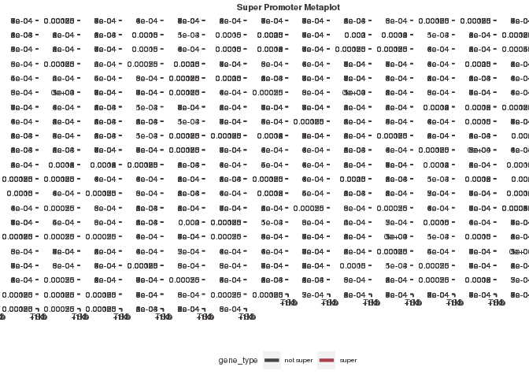<!-- -->

``` r
# saving
#ggsave("figures/super_mega_meta_plot.pdf", width = 49, height = 12)
```

# saving key objects

``` r
#save(lncrna_metaplot_df, mrna_metaplot_df, combined_metaplot_profile, super_binders, super_metaplot_df, non_super_binders, non_super_metaplot_df, file = "results/metaplot_data.RData")

#load("results/metaplot_data.RData", verbose = T)
```

# RNAseq expression

``` r
# First let's read in the sample sheet to know what is what
samplesheet <- read_rds("/scratch/Shares/rinnclass/CLASS_2023/byes1293/CLASS_2023/CLASSES/05_R_analyses/05_RNAseq/01_differential_expression/results/final_samplesheet.rds")

# reading in salmon tpm
salmon_tpm <- read.csv("/scratch/Shares/rinnclass/CLASS_2023/data/data/rnaseq/results/salmon/salmon_merged_gene_tpm.csv")

# TPM table is in same order as samplesheet
tpm <- salmon_tpm %>% 
  pivot_longer(cols = 2:ncol(.), names_to = "sample_id", values_to = "tpm") %>%
  merge(samplesheet) %>%
  group_by(gene_id, condition) %>%
  summarize(tpm = mean(tpm, na.rm = T)) %>%
  pivot_wider(names_from = condition, values_from = tpm, names_prefix = "tpm_")
```

    ## `summarise()` has grouped output by 'gene_id'. You can override using the
    ## `.groups` argument.

``` r
# Now we can merge in the TPM data to this data.frame
# This will merge on the on the gene_id column
promoter_features_df <- merge(peak_occurence_df, tpm)

# saving this file
#write.csv(promoter_features_df, "results/promoter_feature_df_tpm.csv")

### What is the relationship between number of DBPS bound on a promoter versus RNA output (hint TPM) ###
# plotting binding vs total RNA expression
ggplot(promoter_features_df, 
            aes(y = log2(tpm_homo_sapiens_hepg2 + 0.001), x = number_of_dbp, color = gene_type)) + 
geom_point(data = promoter_features_df %>% filter(tpm_homo_sapiens_hepg2 > 0.001),
             shape = 17, alpha = 0.7) +
  geom_smooth(method = 'gam', formula = y ~ s(x, bs = "cs")) +
  #stat_cor() +
  geom_smooth(method = "lm") +
  scale_x_continuous(expand = c(0,0)) +
  scale_color_manual(values = c("#a8404c", "#424242"), name = "Gene type") + 
  ggtitle("Expression vs. promoter binding events") + 
  xlab(expression('Number of TFs')) +
  ylab(expression(log[2](TPM))) 
```

    ## `geom_smooth()` using formula = 'y ~ x'

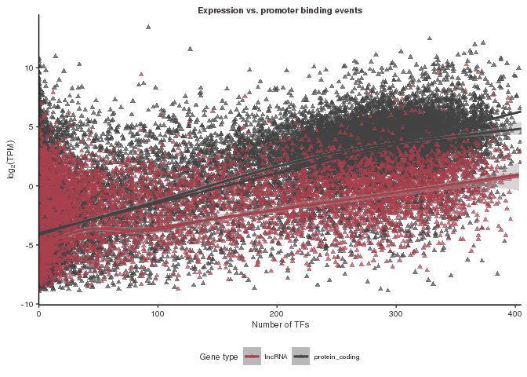<!-- -->

``` r
#ggsave("figures/binding_vs_expression_total_rna.pdf")
```

Result: DBPs bound to a promoter are positively correlated with RNA
expression. Protein coding genes have higher expression than lncRNA
genes. Expression of protein coding genes seem to have a more linear
relationship with number of DBPs bound compared to lncRNA genes.

# Binding versus nuclear expression

``` r
# Now let's make a similar plot for nuclear RNA abundance versus #DBPs bound to their promoter
ggplot(promoter_features_df, 
            aes(y = log2(tpm_homo_sapiens_nuclear_fraction + 0.001), x = number_of_dbp, color = gene_type)) + 
  geom_point(data = promoter_features_df %>% filter(tpm_homo_sapiens_nuclear_fraction > 0.001),
             shape = 17, alpha = 0.7) +
  geom_smooth(method = 'gam', formula = y ~ s(x, bs = "cs")) +
  #stat_cor() +
  
  
  #making look nice
  scale_x_continuous(expand = c(0,0)) +
  scale_color_manual(values = c("#a8404c", "#424242"), name = "Gene type") + 
  ggtitle("Nuclear Expression vs. promoter binding events") + 
  xlab(expression('Number of TFs')) +
  ylab(expression(log[2](TPM))) 
```

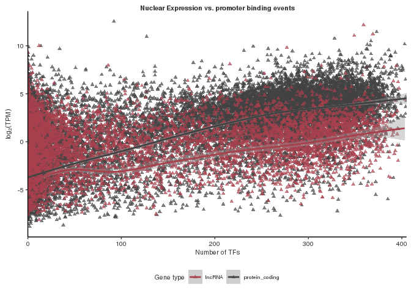<!-- -->

``` r
# saving figure
#ggsave("figures/nuclear_expression-vs-promoter_binding.pdf")
```

Result: looks very similar to total RNA binding versus expression

# Binding versus cytoplasmic expression

``` r
# Same thing just seeing if there is a difference of cyto RNAs versus DBPs on promoter
ggplot(promoter_features_df, 
            aes(y = log2(tpm_homo_sapiens_cytosolic_fraction + 0.001), x = number_of_dbp, color = gene_type)) + 
  geom_point(data = promoter_features_df %>% filter(tpm_homo_sapiens_cytosolic_fraction > 0.001),
             shape = 17, alpha = 0.7) +
  geom_smooth(method = 'gam', formula = y ~ s(x, bs = "cs")) +
  #stat_cor() +
  
  
  # making look nice
  scale_x_continuous(expand = c(0,0)) +
  scale_color_manual(values = c("#a8404c", "#424242"), name = "Gene type") + 
  ggtitle("Cytoplasmic Expression vs. promoter binding events") + 
  xlab(expression('Number of TFs')) +
  ylab(expression(log[2](TPM))) 
```

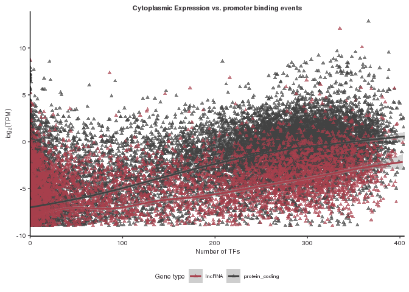<!-- -->

``` r
# saving figure
#ggsave("figures/cytoplasmic_expression-vs-promoter_binding.pdf")
```

RESULTS: (1) everything seems to be low abundance (2) Some mRNAs are
expressed in the nucleus – we could look at this more later. (3) The
same linear trend holds but is driven by mostly low expression events.

# lncRNA vs mRNA expression in total RNA

``` r
# plotting
ggplot(promoter_features_df, aes(x = log2(tpm_homo_sapiens_hepg2 + 0.01), color = gene_type))+
  geom_density()
```

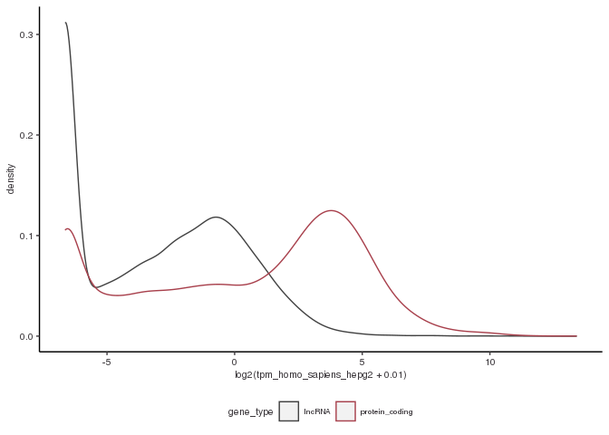<!-- -->

``` r
# saving figure
#ggsave("figures/mrna_lncrna_tpm_total_rna.pdf")

# let's also do the same for nuclear since lncRNAs are typically more nuclear
ggplot(promoter_features_df, aes(x = log2(tpm_homo_sapiens_nuclear_fraction + 0.01), color = gene_type))+
  geom_density()
```

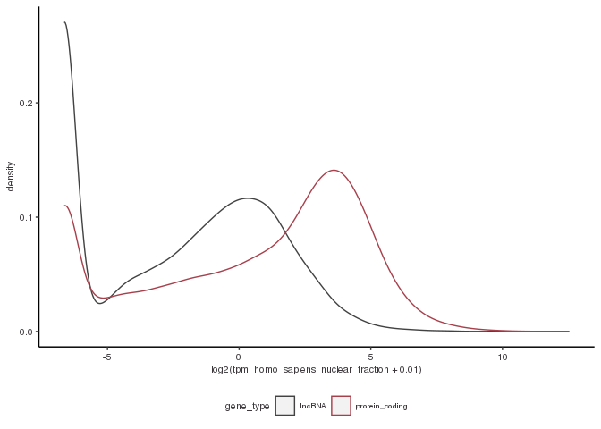<!-- -->

``` r
# saving figure
#ggsave("figures/mrna_lncrna_tpm_nuclear.pdf")
```

RESULT: (1) This yet again confirms lncRNAs have lower expression levels
than mRNAs. (2) In the nuclear fraction it shift’s to closer. (3) lot’s
of mRNA with nuclear expression – that seems odd

# super binding vs expression

``` r
ggplot(promoter_features_df, 
            aes(y = log2(tpm_homo_sapiens_hepg2 + 0.001), x = number_of_dbp, color = super_binder)) + 
geom_point(data = promoter_features_df %>% filter(tpm_homo_sapiens_hepg2 > 0.001),
             shape = 17, alpha = 0.7) +
  
  # Adding a generative additive model 
  geom_smooth(method = 'gam', formula = y ~ s(x, bs = "cs")) +
  # this adds the statistics from the gam to the figure
  #stat_cor() +
  geom_smooth(method = "lm") +
  # this is just to make it look nice.
  scale_x_continuous(expand = c(0,0)) +
  # adding colors manually
  scale_color_manual(values = c("#a8404c", "#424242"), name = "Super Binder") + 
  # title
  ggtitle("Expression vs. promoter binding events (split by super binder)") + 
  # labeling axes
  xlab(expression('Number of TFs')) +
  ylab(expression(log[2](TPM))) 
```

    ## `geom_smooth()` using formula = 'y ~ x'

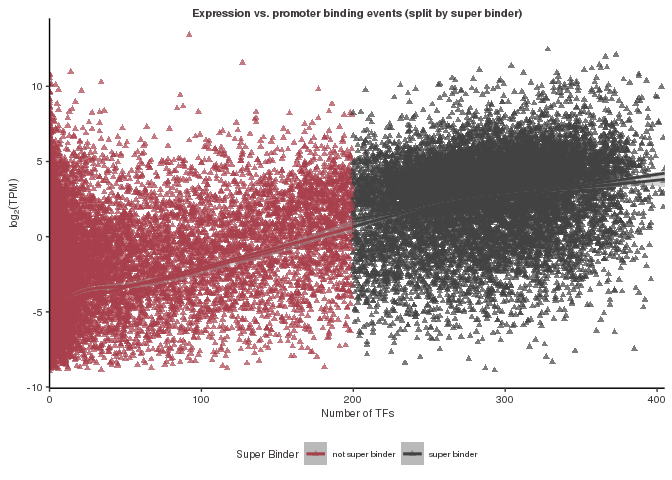<!-- -->

``` r
#ggsave("figures/binding_vs_expression_total_rna_super.pdf")
```

Result - If we look at the trend for only the super promoters, it is
linear but less steep than the trend for the lower binding promoters.
There are still a large number of super binders with low expression.

# Zooming in

``` r
### If we zoom in on high binding promoters (> 200 DBPs) are there any that don't have any expression? ###
zoomed_df <- promoter_features_df[promoter_features_df$super_binder == "super binder",]

ggplot(zoomed_df, 
            aes(y = log2(tpm_homo_sapiens_hepg2 + 0.001), x = number_of_dbp, color = gene_type)) + 
geom_point(data = zoomed_df %>% filter(tpm_homo_sapiens_hepg2 > 0.001),
             shape = 17, alpha = 0.7) +
  
  # Adding a generative additive model 
  geom_smooth(method = 'gam', formula = y ~ s(x, bs = "cs")) +
  # this adds the statistics from the gam to the figure
  stat_cor() +
  geom_smooth(method = "lm") +
  # this is just to make it look nice.
  scale_x_continuous(expand = c(0,0)) +
  # adding colors manually
  scale_color_manual(values = c("#a8404c", "#424242"), name = "Gene type") + 
  # title
  ggtitle("Expression vs. promoter binding events (zoomed in on super binders)") + 
  # labeling axes
  xlab(expression('Number of TFs')) +
  ylab(expression(log[2](TPM))) 
```

    ## `geom_smooth()` using formula = 'y ~ x'

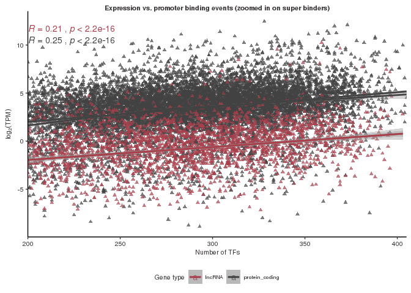<!-- -->

``` r
#ggsave("figures/binding_vs_expression_total_rna_zoomed.pdf")
```

Result - mRNA super binders have higher expression levels, but also
pretty large variance in expression levels, and many of the cases with
low expression are in mRNA super binders. The trend between binding and
expression is very similar between lncRNA and mRNA super binders.

# Now with nuclear expression

``` r
# Now let's make a similar plot for nuclear RNA abundance versus #DBPs bound to their promoter
ggplot(promoter_features_df, 
            aes(y = log2(tpm_homo_sapiens_nuclear_fraction + 0.001), x = number_of_dbp, color = super_binder)) + 
  geom_point(data = promoter_features_df %>% filter(tpm_homo_sapiens_nuclear_fraction > 0.001),
             shape = 17, alpha = 0.7) +
  geom_smooth(method = 'gam', formula = y ~ s(x, bs = "cs")) +
  stat_cor() +
  scale_x_continuous(expand = c(0,0)) +
  scale_color_manual(values = c("#a8404c", "#424242"), name = "Super binder") + 
  ggtitle("Nuclear Expression vs. promoter binding events (separated by super binder)") + 
  xlab(expression('Number of TFs')) +
  ylab(expression(log[2](TPM))) 
```

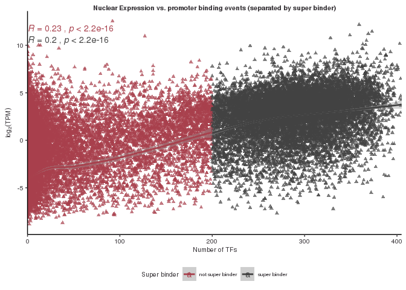<!-- -->

``` r
# saving figure
#ggsave("figures/nuclear_expression-vs-promoter_binding_super.pdf")
```

Result: The result for nuclear expression looks very similar to the
overall result.

# Binding vs cytoplasmic expression

``` r
# Same thing just seeing if there is a difference of cyto RNAs versus DBPs on promoter
ggplot(promoter_features_df, 
            aes(y = log2(tpm_homo_sapiens_cytosolic_fraction + 0.001), x = number_of_dbp, color = super_binder)) + 
            # note if we take off the log2 everything is very lowly expressed
  geom_point(data = promoter_features_df %>% filter(tpm_homo_sapiens_cytosolic_fraction > 0.001),
             shape = 17, alpha = 0.7) +
  geom_smooth(method = 'gam', formula = y ~ s(x, bs = "cs")) +
  stat_cor() +
  scale_x_continuous(expand = c(0,0)) +
  scale_color_manual(values = c("#a8404c", "#424242"), name = "Gene type") + 
  ggtitle("Cytoplasmic Expression vs. promoter binding events") + 
  xlab(expression('Number of TFs')) +
  ylab(expression(log[2](TPM))) 
```

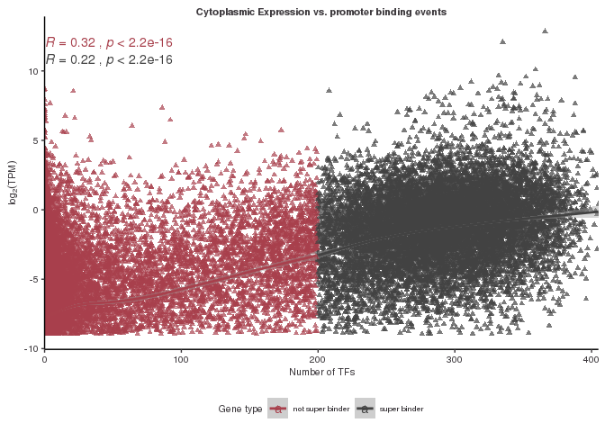<!-- -->

``` r
#ggsave("figures/cytoplasmic_expression-vs-promoter_binding_super.pdf")
```

The trends are similar for super binders vs. not super binders, and not
as strong. There are overall many cases where there is low expression
with high expression outliers in both super binders and non super
binders.
